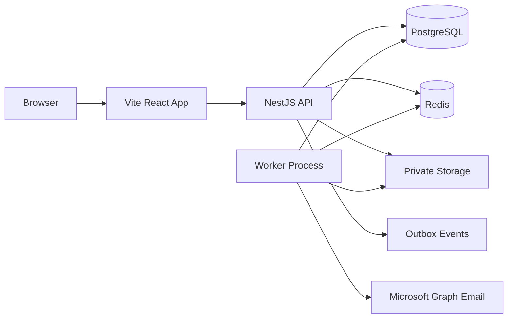
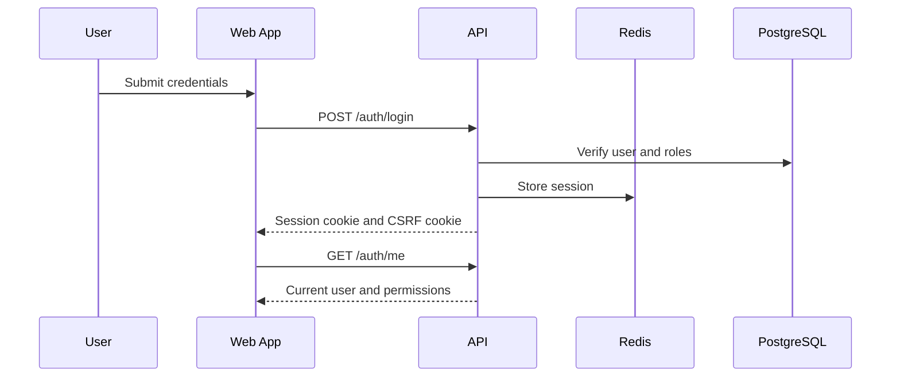

# 02. Architecture And Technical Design

## 1. System Architecture

ProcureDesk uses a modular monolith architecture. The frontend, API, and worker are separate runtime processes, but business logic is kept in one codebase for maintainability and delivery speed.

## 2. Runtime Components

Frontend:

- Located in `apps/web`.
- React/Vite TypeScript application.
- Uses module workspaces and shared UI primitives.
- Uses TanStack Query for API server state.

Backend API:

- Located in `apps/api`.
- NestJS with Fastify adapter.
- Uses Zod validation.
- Uses guards for authentication and permission enforcement.
- Uses repositories for SQL access.

Worker:

- Located in `apps/worker`.
- Handles imports, exports, notifications, reporting projections, and outbox dispatch.
- Reads PostgreSQL and Redis.
- Writes private generated files to storage.

Database:

- PostgreSQL with SQL migrations.
- Tenant-aware schemas.
- RLS migration exists for tenant isolation.

Redis:

- Used for runtime cache, queue coordination, sessions/rate-limit behavior depending on service configuration.

## 3. Backend Module Design

API modules are under `apps/api/src/modules`.

| Module | Responsibility |
| --- | --- |
| `identity-access` | Authentication, users, roles, permissions, sessions |
| `organization` | Tenants, entities, departments |
| `catalog` | Choice lists, tender types, completion rules |
| `procurement-cases` | Case lifecycle, milestones, dashboard summary |
| `awards` | Case awards and awarded vendor details |
| `planning` | Tender plans and RC/PO expiry |
| `reporting` | Analytics, reports, saved views, exports |
| `import-export` | Import templates, jobs, staging, exports |
| `notifications` | Notification rules and previews |
| `operations` | Dead-letter and operational diagnostics |
| `outbox` | Durable event dispatch |

Request lifecycle:

1. Request enters Fastify/Nest.
2. Auth guard validates session.
3. Permission guard validates required permissions.
4. Zod pipe validates request body/query.
5. Controller calls application service.
6. Service enforces business logic.
7. Repository performs SQL.
8. Problem details filter normalizes errors.
9. Audit/outbox records are written for important actions.

## 4. Frontend Architecture

Frontend structure:

| Path | Purpose |
| --- | --- |
| `apps/web/src/app` | App shell, providers, authenticated layout |
| `apps/web/src/features` | Business modules |
| `apps/web/src/shared/api` | API client |
| `apps/web/src/shared/auth` | Auth provider |
| `apps/web/src/shared/ui` | Shared UI primitives |
| `apps/web/src/shared/routing` | Routing helpers |
| `apps/web/src/styles.css` | Design system and application styling |

Design principles:

- Left sidebar is the main navigation.
- Major modules use horizontal sub-navigation where needed.
- Tables use consistent filters, pagination, states, and actions.
- Drawers are used for preview/edit flows where users need table context.
- Admin pages use focused cards/forms instead of giant stacked dashboards.

Important shared UI:

- `Button`
- `DataTable`
- `VirtualTable`
- `Modal`
- `Drawer`
- `FilterBar`
- `FilterDrawer`
- `SecondaryNav`
- `PageHeader`
- `KpiTile`
- `StatusBadge`
- `ConfirmationDialog`
- `ToastProvider`

## 5. Multi-Tenant Design

The system uses these tenant layers:

| Layer | Meaning |
| --- | --- |
| Tenant | Customer organization boundary |
| Entity | Business unit/company/plant inside tenant |
| Department | User department inside entity |
| User scope | Entity access assigned to user |

Rules:

- Tenant data must be tenant scoped.
- Users operate inside tenant context.
- Entity-scoped roles should only see assigned entities.
- Imports must validate row entity access.
- Reports must filter by tenant and entity scope.
- Tenant-created choice categories are tenant-specific.
- System choice categories are global and protected.

## 6. Authentication And Authorization

Authentication:

Authorization:

- Permissions are assigned to roles.
- Users have roles.
- Users may have entity scopes.
- API endpoints use permission decorators.
- UI hides unavailable modules/actions based on permissions.
- Server remains authoritative; UI checks are convenience only.

Critical rules:

- Do not remove the last active tenant admin.
- System roles are protected.
- Platform super-admin access must be exceptional.
- Custom roles should remain understandable for tenant admins.

## 7. Queue And Worker Architecture

Worker areas:

| Area | Purpose |
| --- | --- |
| Imports | Parse templates, validate rows, stage/commit data |
| Exports | Generate XLSX/CSV files |
| Notifications | Send Microsoft Graph emails when configured |
| Reporting projections | Refresh read models |
| Outbox | Dispatch durable events |

Queue reliability rules:

- Jobs should be idempotent where possible.
- Failed jobs should be visible in operations/dead-letter views.
- Long-running work should not block API requests.
- Import commits should be explicit after preview.
- Exports should have status and expiry.

## 8. Caching Strategy

Catalog/reference data is cached per tenant where appropriate. Cache invalidation is required after:

- Reference value changes.
- Reference category changes.
- Tender type changes.
- Completion rule changes.

Do not cache permission-sensitive query results unless the cache key includes tenant/user/scope context.

## 9. Extension Guidelines

When adding new features:

- Add API schema validation.
- Add permission guard.
- Keep business logic in service layer.
- Keep SQL in repository.
- Add audit events for configuration or business-state changes.
- Use existing UI primitives before adding new patterns.
- Update this documentation.

