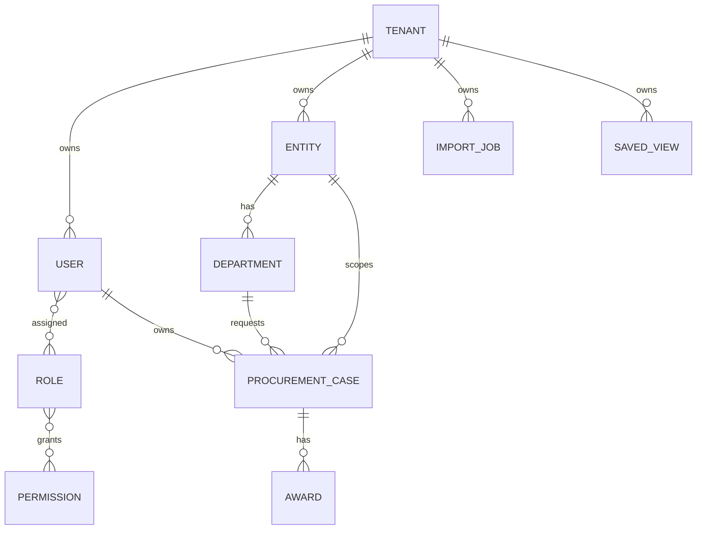

# 04. API, Database And Data Model

## 1. API Conventions

Base path:

`/api/v1`

Common behavior:

- Session cookie authentication.
- CSRF protection for unsafe methods.
- Permission guards on protected endpoints.
- Zod schema validation.
- Problem Details error format.
- `limit` and `offset` pagination where supported.

Common error shape:

```json
{
  "type": "https://procuredesk.local/problems/400",
  "title": "Bad Request",
  "status": 400,
  "detail": "Validation failed."
}
```

## 2. Authentication API

| Method | Endpoint | Purpose |
| --- | --- | --- |
| `POST` | `/auth/login` | Authenticate user |
| `POST` | `/auth/logout` | Invalidate session |
| `GET` | `/auth/me` | Current user profile |

Login body:

```json
{
  "username": "tenant.admin",
  "password": "********"
}
```

## 3. Procurement Case API

| Method | Endpoint | Purpose |
| --- | --- | --- |
| `GET` | `/cases` | List procurement cases |
| `POST` | `/cases` | Create case |
| `GET` | `/cases/:caseId` | Get case detail |
| `PATCH` | `/cases/:caseId` | Update case details |
| `PATCH` | `/cases/:caseId/assignment` | Update owner |
| `PATCH` | `/cases/:caseId/milestones` | Update milestones |
| `PATCH` | `/cases/:caseId/delay` | Update delay |
| `DELETE` | `/cases/:caseId` | Soft delete case |
| `POST` | `/cases/:caseId/restore` | Restore case |

Awards:

| Method | Endpoint | Purpose |
| --- | --- | --- |
| `GET` | `/cases/:caseId/awards` | List awards |
| `POST` | `/cases/:caseId/awards` | Create award |
| `PATCH` | `/cases/:caseId/awards/:awardId` | Update award |
| `DELETE` | `/cases/:caseId/awards/:awardId` | Delete award |

## 4. Planning API

| Method | Endpoint | Purpose |
| --- | --- | --- |
| `GET` | `/planning/tender-plans` | List tender plans |
| `POST` | `/planning/tender-plans` | Create tender plan |
| `PATCH` | `/planning/tender-plans/:planId` | Update tender plan |
| `GET` | `/planning/rc-po-plans` | List RC/PO plans |
| `POST` | `/planning/rc-po-plans` | Create RC/PO plan |
| `PATCH` | `/planning/rc-po-plans/:planId` | Update RC/PO plan |
| `GET` | `/planning/rc-po-expiry` | List expiry risks |

## 5. Reporting API

| Method | Endpoint | Purpose |
| --- | --- | --- |
| `GET` | `/reports/analytics` | Analytics dashboard |
| `GET` | `/reports/tender-details` | Tender details report |
| `GET` | `/reports/running` | Running report |
| `GET` | `/reports/completed` | Completed report |
| `GET` | `/reports/vendor-awards` | Vendor award report |
| `GET` | `/reports/stage-time` | Stage time report |
| `GET` | `/reports/rc-po-expiry` | Expiry report |
| `GET` | `/reports/filter-metadata` | Report filters |
| `GET` | `/reports/saved-views` | Saved views |
| `POST` | `/reports/saved-views` | Create saved view |
| `POST` | `/reports/export-jobs` | Queue export |
| `GET` | `/reports/export-jobs/:jobId` | Export status |
| `GET` | `/reports/export-jobs/:jobId/download` | Download export |

## 6. Import API

| Method | Endpoint | Purpose |
| --- | --- | --- |
| `POST` | `/imports/upload/:importType` | Upload import file |
| `POST` | `/imports/file-assets` | Store file asset |
| `POST` | `/imports/jobs` | Create import job |
| `GET` | `/imports/jobs` | List jobs |
| `GET` | `/imports/jobs/:importJobId/rows` | Preview rows |
| `GET` | `/imports/jobs/:importJobId/problem-rows.csv` | Problem rows |
| `POST` | `/imports/jobs/:importJobId/commit` | Commit import |

Templates:

- `/imports/templates/tender-cases.xlsx`
- `/imports/templates/portal-user-mapping.xlsx`
- `/imports/templates/user-department-mapping.xlsx`
- `/imports/templates/old-contracts.xlsx`

## 7. Admin API

Users and roles:

- `GET /admin/users`
- `POST /admin/users`
- `PATCH /admin/users/:userId`
- `PATCH /admin/users/:userId/status`
- `PUT /admin/users/:userId/roles`
- `PUT /admin/users/:userId/entity-scopes`
- `GET /admin/roles`
- `POST /admin/roles`
- `PATCH /admin/roles/:roleId`
- `DELETE /admin/roles/:roleId`
- `GET /admin/permissions`

Entities and departments:

- `GET /entities`
- `POST /admin/entities`
- `PATCH /admin/entities/:entityId`
- `DELETE /admin/entities/:entityId`
- `GET /entities/:entityId/departments`
- `POST /admin/entities/:entityId/departments`
- `PATCH /admin/departments/:departmentId`
- `DELETE /admin/departments/:departmentId`

Catalog:

- `GET /catalog`
- `POST /admin/catalog/reference-categories`
- `PATCH /admin/catalog/reference-categories/:categoryId`
- `DELETE /admin/catalog/reference-categories/:categoryId`
- `POST /admin/catalog/reference-values`
- `PATCH /admin/catalog/reference-values/:referenceValueId`
- `DELETE /admin/catalog/reference-values/:referenceValueId`
- tender type and completion rule endpoints.

## 8. Database Schemas

| Schema | Purpose |
| --- | --- |
| `iam` | Tenants, users, roles, permissions, sessions |
| `organization` | Entities and departments |
| `catalog` | Reference categories/values, tender types, rules |
| `procurement` | Cases, milestones, awards |
| `reporting` | Read models, saved views, export jobs |
| `imports` | Import jobs and staging |
| `audit` | Audit events |
| `operations` | Dead letters and diagnostics |

## 9. ER Overview



## 10. Migration Strategy

Migration files:

- `db/migrations/0001_foundation.sql`
- `db/migrations/committed/000002_rls.sql`
- `db/migrations/committed/000003_idempotency.sql`
- `db/migrations/committed/000004_indexes.sql`
- `db/migrations/committed/000005_import_extensions.sql`
- `db/migrations/committed/000006_tenant_choice_categories.sql`

Rules:

- Migrations must be deterministic.
- Always run with `ON_ERROR_STOP=1`.
- Review RLS and tenant isolation.
- Document operational impact in release notes.
- Prefer forward-fix migrations in production unless rollback is tested.

## 11. Important Data Rules

- Tenant-owned tables require tenant isolation.
- Audit rows should be append-only.
- Do not store secrets in audit metadata.
- Used catalog values should be deactivated, not deleted.
- System catalog categories and roles are protected.
- Tenant catalog categories are tenant-specific.

