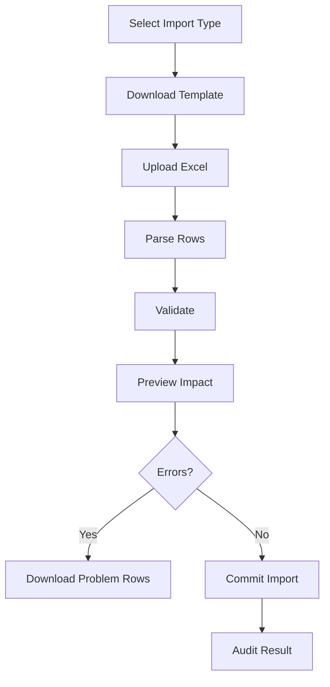

# 06. Imports, Reports And Roadmap

## 1. Import System Purpose

The import system is an enterprise procurement onboarding and migration framework. It should not be treated as a simple file upload. It must preserve official Excel terminology, validate data safely, detect duplicates, preview impact, and provide audit-ready processing.

## 2. Supported Imports

### Tender Case Import

Used for current tender onboarding. Key fields include:

- Entity.
- PR Receiving Medium.
- Tender Owner.
- PR/Scheme No.
- PR/Scheme Receipt Date.
- PR Description.
- PR Value / Approved Budget.
- CPC Involved.
- Nature of Work.
- User Department.
- Tender Type.
- Priority.
- Milestone dates.
- Bidder counts.
- NFA fields.
- LOI fields.
- RC/PO award and validity.

Critical validation:

- Entity active and accessible.
- Owner belongs to selected entity.
- PR/Scheme No unique within entity.
- Date chronology valid.
- Qualified bidders do not exceed participated bidders.
- RC/PO validity after award date.

### Old Contract Import

Used for historical migration and legacy contract onboarding.

Official columns:

1. Entity
2. User Department
3. Tender Owner
4. Tender Description
5. Awarded Vendors (comma separated)
6. RC/PO Amount (Rs.)
7. RC/PO Award Date
8. RC/PO Validity Date

Validation:

- Entity/department mapping.
- Tender owner access.
- Vendor normalization.
- Amount positive.
- Validity after award date.
- Duplicate contract analysis.

### Portal User Mapping Import

Official columns:

1. Entity
2. Full Name
3. Access Level Required
4. Access Level Definition
5. Mail ID
6. Contact No.

Validation:

- Active entity.
- Valid role/access level.
- Email format.
- Duplicate email/contact detection.
- Existing user conflict detection.

### User Department Mapping Import

Official columns:

1. Entity
2. User Department

Validation:

- Active entity.
- Mandatory department.
- Case-insensitive duplicate detection.
- Department normalization.

## 3. Import Workflow

Business-friendly wording:

- Use “Validate & Preview”.
- Use “Commit Import”.
- Avoid “dry run” in UI.
- Do not expose internal JSON or staging details to business users.

## 4. Import Error Management

Each error should include:

- Row number.
- Column label.
- Error code.
- Severity.
- Human-readable message.
- Suggested correction.

Severity:

| Severity | Meaning |
| --- | --- |
| Error | Blocks commit |
| Warning | Allows commit with review |
| Info | Advisory only |

## 5. Reporting System

Reports covered:

- Analytics.
- Tender Details.
- Running.
- Completed.
- Vendor Awards.
- Stage Time.
- RC/PO Expiry.
- Saved Views.
- Export Jobs.

Report principles:

- Keep analytics separate from detailed reports.
- Keep filters compact.
- Use saved views for repeatable report setups.
- Export jobs should be clear, trackable, and downloadable.
- Empty states should explain what to do next.

## 6. KPI Definitions

| KPI | Definition |
| --- | --- |
| Total | Count of rows after filters |
| Running | Running cases after filters |
| Completed | Completed cases after filters |
| Delayed | Cases exceeding target/delay rules |
| Awarded | Sum of awarded amount |
| Savings WRT PR | PR/approved budget minus awarded amount |
| Avg Bidders | Average participated bidder count |
| Avg Qualified | Average qualified bidder count |

Rules:

- KPIs must respect current filters.
- Empty numeric values should show `-` where zero would be misleading.
- Currency/unit formatting must stay consistent across cards, charts, and tables.

## 7. Export Framework

Supported formats:

- XLSX.
- CSV.

Export lifecycle:

1. User requests export.
2. API creates export job.
3. Worker generates file.
4. Status updates.
5. User downloads file.
6. File expires based on policy.

Statuses:

- Queued.
- Processing.
- Completed.
- Failed.
- Expired.

Security:

- Exports must be tenant scoped.
- Download endpoint must enforce authentication.
- Files must remain in private storage.

## 8. Known Issues

Current known items:

- Microsoft Graph notifications require Graph environment configuration.
- OpenAPI/Postman generation is not automated.
- Production contacts and support SLAs must be filled during formal handover.
- Reporting projection freshness should be made visible in the UI in a future release.

## 9. Technical Debt

| Area | Debt | Impact | Recommendation |
| --- | --- | --- | --- |
| API docs | OpenAPI generation not automated | Manual docs can drift | Add OpenAPI generation in CI |
| CSS | Large centralized stylesheet | Cross-module styling risk | Gradually extract component/module CSS |
| Imports | Validation metadata should keep consolidating | Risk of duplicated rules | Centralize import metadata registry |
| Reports | Projection freshness not obvious | User trust risk | Add freshness/status indicator |
| Tests | E2E coverage limited | Regression risk | Add Playwright smoke suite |

## 10. Roadmap

Near-term:

- Generate OpenAPI docs.
- Add Playwright smoke tests.
- Add report projection freshness indicator.
- Improve import error Excel highlighting.
- Add queue status UI.

Medium-term:

- Advanced approval matrix.
- SSO integration.
- SAP/ERP integration using same import validation pipeline.
- More granular workflow state machine.
- Better admin metadata configuration for imports.

Long-term:

- Reporting read replica.
- Queue partitioning by workload.
- Configurable tenant SLA/escalation rules.
- Advanced audit retention policy.
- Enterprise integration marketplace pattern.

## 11. Final Production Readiness Verdict

The platform has a solid modular foundation: typed frontend, NestJS API, SQL-backed domain model, RBAC, audit, worker processing, imports, reports, and admin configuration. The main production-readiness focus areas before large-scale rollout are:

- automated OpenAPI docs,
- stronger E2E regression suite,
- completed production secret/contact ownership,
- import/report worker observability,
- formal approval workflow roadmap,
- complete production backup/restore rehearsal.

