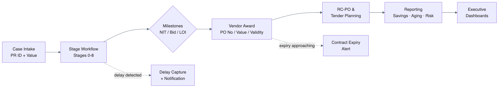
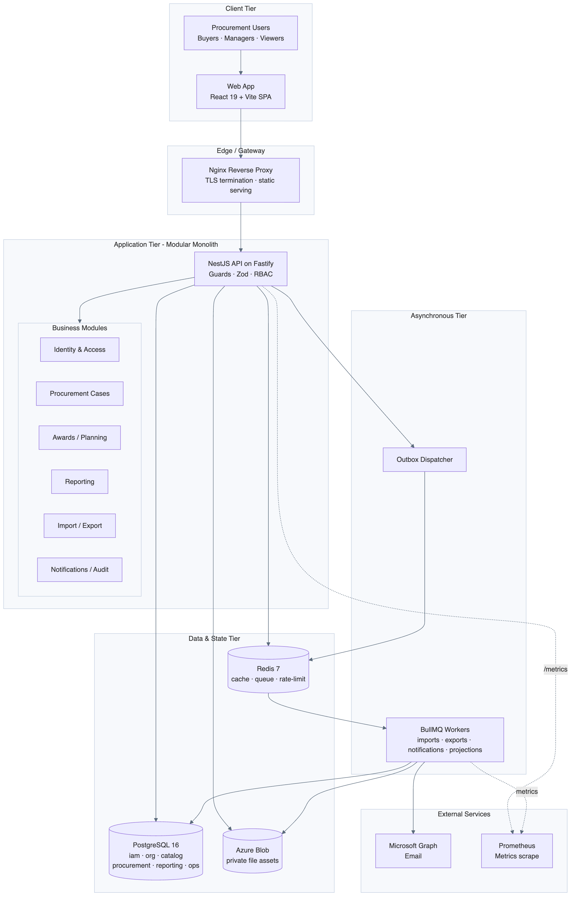
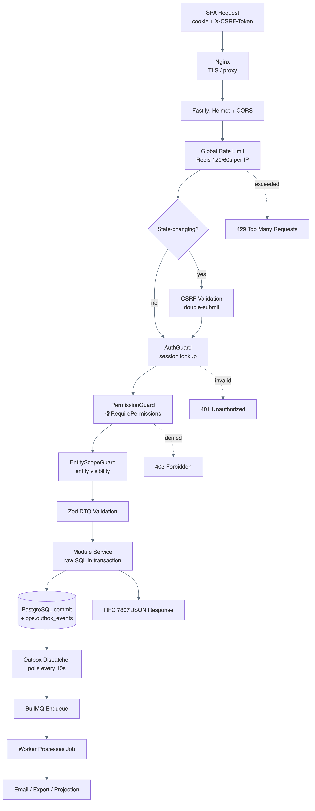
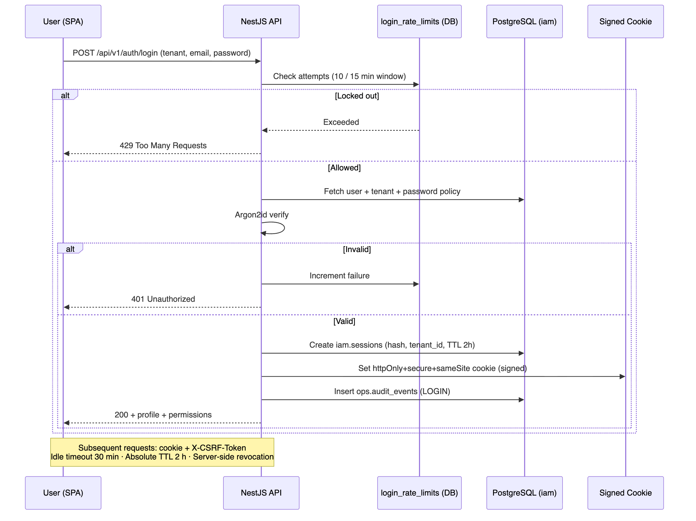
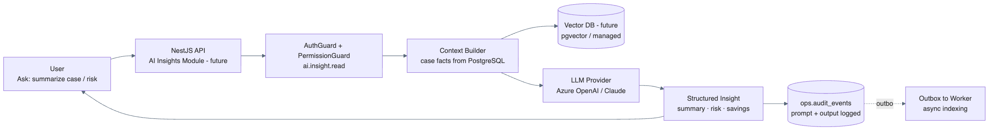
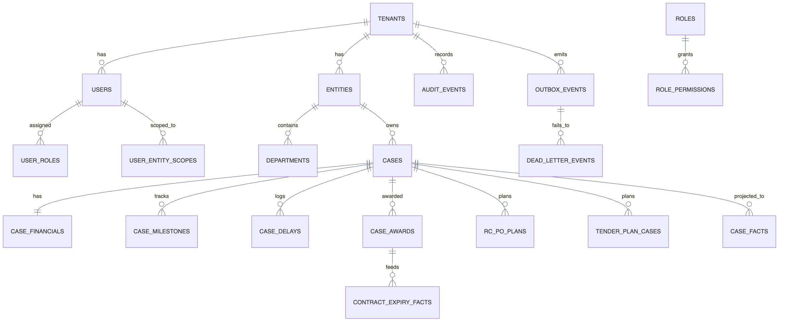
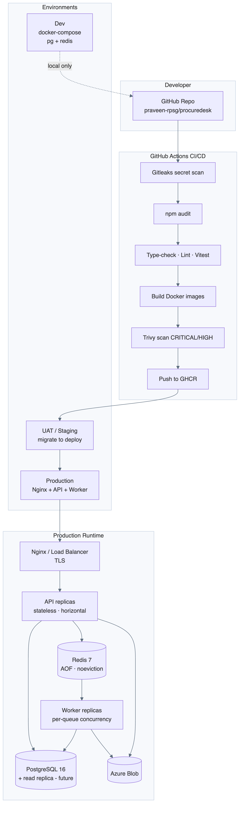
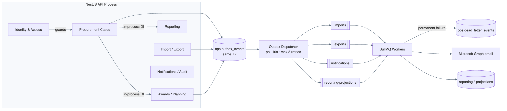

# ProcureDesk Platform — Technical Summary & Architecture

**Document Type:** Enterprise Technical Summary
**Audience:** Management · Technical Review Board · Stakeholders
**Owner:** RPSG Procurement Technology
**Status:** Production (Phase 1–3 live) · **Version:** 1.0 · **Date:** 2026-05-19

---

## 1. Executive Summary

**ProcureDesk** is RPSG's centralized, multi-tenant **procurement command center**. It digitizes the end-to-end indirect/tender procurement lifecycle — from procurement-case intake through tendering, vendor award, purchase-order planning, contract-expiry tracking, and executive reporting — for procurement teams operating across multiple RPSG group entities.

**Business Problem Solved**

- Procurement cases, tenders, and PO awards were tracked across disconnected spreadsheets with no single source of truth, weak audit trails, and no consolidated visibility for leadership.
- ProcureDesk replaces this with a governed system: stage-driven case workflows, entity-scoped access control, savings/benchmark analytics, contract-expiry alerts, and an immutable audit log.

**Business Value**

| Dimension | Impact |
|---|---|
| **Visibility** | Real-time dashboards for case status, stage aging, delays, and savings (vs. PR and vs. estimate). |
| **Governance** | Role + entity + permission-scoped access; immutable audit trail for compliance. |
| **Cycle Time** | Stage-policy SLAs and delay tracking surface bottlenecks early. |
| **Financial Control** | Tracks PR value, approved amount, awarded value, and quantified savings. |
| **Risk Reduction** | Automated contract/PO expiry alerts prevent lapsed-contract exposure. |
| **Productivity** | Bulk Excel import/export removes manual data re-entry. |

**Key Objectives**

1. One governed system of record for all procurement cases across RPSG entities.
2. Enforce stage workflows, SLAs, and least-privilege access.
3. Deliver leadership-grade analytics on savings, aging, and risk.
4. Provide a secure, auditable, horizontally scalable, cloud-deployable foundation.

**Expected Impact:** Reduced procurement cycle time, measurable savings visibility, eliminated contract-lapse risk, and audit-ready compliance for group procurement governance.

---

## 2. Feature Summary

### Core Modules

| Module | Capabilities | Primary Roles |
|---|---|---|
| **Identity & Access** | Login, forgot/reset password, profile, user & role administration, per-tenant password policy, session revocation. | Super Admin, Administration Manager |
| **Organization** | Entities, departments, user→entity scope assignment. | Administration Manager |
| **Catalog (Master Data)** | Reference categories/values, tender types, stage policies & completion rules. | Administration Manager |
| **Procurement Cases** | Case CRUD, stage workflow (0–8), milestones, delay capture, soft-delete/restore, full-text discovery. | Group/Entity Manager, Tender Owner |
| **Awards** | Vendor award creation, PO number/value/validity tracking, award-expiry monitoring. | Group/Entity Manager, Tender Owner |
| **Planning** | RC-PO plans and tender-plan cases with planned dates and calendar view. | Group/Entity Manager |
| **Reporting** | Case analysis, bid evaluation, tender tracking, entity completion, vendor analytics; user-saved views; async export. | All roles (read-scoped) |
| **Import / Export** | Async Excel/CSV upload → staged validation → commit; queued report exports. | Roles with import/export permission |
| **Notifications** | Per-tenant rules (manual/daily/weekly) for milestones, delays, expiry, import completion via Microsoft Graph email. | Administration Manager |
| **Audit** | Immutable, queryable action log (actor, target, before/after, IP, UA). | Administration Manager |
| **Operations** | Health/readiness, Prometheus metrics, outbox & job monitoring. | Platform Admin / SRE |

### Representative Workflow — Procurement Case Lifecycle

### User Roles & Permissions (RBAC)

Access = **Role** × **Access Level (GROUP / ENTITY / USER)** × **Permission matrix** × **Entity scope**.

| Role | Access Level | Scope |
|---|---|---|
| Super Admin | GROUP | Full platform authority (bypasses checks) |
| Administration Manager | GROUP | Admin console, users/roles, security, audit |
| Group Manager | GROUP | All procurement ops tenant-wide |
| Entity Manager | ENTITY | Procurement ops for assigned entities only |
| Tender Owner | USER | Owned/assigned cases & awards; reporting |
| Entity Viewer | ENTITY | Read-only, assigned entities |
| Group Viewer | GROUP | Read-only, group-wide |

Enforcement: API routes guarded by `AuthGuard` → `PermissionGuard` (`@RequirePermissions`) → `EntityScopeGuard`. System roles are protected from modification; last-admin removal is blocked.

---

## 3. System Architecture

ProcureDesk is a **modular monolith** (single NestJS API process exposing all business modules) paired with a **decoupled asynchronous worker tier** (BullMQ on Redis). PostgreSQL 16 is the single source of truth; Redis provides caching, rate-limit counters, and the job queue. Cross-tier side effects use a **transactional outbox** for guaranteed eventual consistency.

**Tech Stack (actual)**

| Layer | Technology |
|---|---|
| Frontend | React 19, Vite 6, TanStack Router 1.88, TanStack Query 5.62, Tailwind, TypeScript 5.7 |
| Backend | NestJS 10.4 on Fastify 4.28, Zod validation, TypeScript 5.7 |
| Worker | BullMQ 5.34, tsx, pino |
| Database | PostgreSQL 16 via raw `pg` driver (no ORM); SQL migrations |
| Cache / Queue | Redis 7 (ioredis, BullMQ) |
| AuthN/Z | Session cookies + DB sessions, Argon2id hashing, RBAC, multi-tenant |
| File Storage | Azure Blob (prod) / local FS (dev) |
| Email | Microsoft Graph API (OAuth2 app permission) |
| Observability | pino logs, Prometheus (`prom-client`), health/readiness probes |
| Build/Deploy | pnpm monorepo, Docker, Nginx, GitHub Actions (Gitleaks, Trivy, npm audit), GHCR |
| AI/LLM | **Not implemented** — architectural seam reserved (see §4.4) |

**Data Flow (request → persistence → async)**

1. Browser SPA calls `/api/v1/*` with signed session cookie + `X-CSRF-Token`.
2. Fastify pipeline: Helmet → CORS → rate-limit → CSRF → `AuthGuard` → `PermissionGuard` → `EntityScopeGuard`.
3. Zod validates the DTO; the module service executes raw parameterized SQL within a transaction.
4. Side effects (notification, reporting refresh, audit) are written to `ops.outbox_events` **in the same transaction**.
5. The outbox dispatcher enqueues BullMQ jobs; workers process imports/exports/notifications/projections.
6. Workers deliver email via Microsoft Graph and refresh `reporting.*` projection tables.

**External Integrations:** Microsoft Graph (email), Azure Blob Storage (private file assets), GitHub Container Registry (image distribution).

---

## 4. Detailed Architecture Diagrams

### 4.1 High-Level System Architecture

### 4.2 Application Flow Diagram (Request Lifecycle)

### 4.3 Authentication & Session Flow

### 4.4 AI / LLM Interaction Flow — Future-State Seam (Not Yet Implemented)

> **Assumption / Note:** No LLM is in current production scope (no OpenAI/Claude/Gemini/vector-DB dependency). The architecture intentionally reserves a clean seam: a future **AI Insights** module behind the same RBAC, with prompt/response logging routed through the existing audit + outbox patterns. The diagram below is the **recommended target design**, not current state.

### 4.5 Database / Data Layer Design

**Schema namespaces:** `iam` (identity/sessions/policies) · `org` (entities/departments) · `catalog` (master data) · `procurement` (cases, financials, awards, plans) · `reporting` (pre-projected facts, saved views) · `ops` (audit, outbox, DLQ, file assets, import/export jobs, notification rules).
**Conventions:** UUID surrogate keys, `citext` natural keys, `timestamptz`, `numeric(18,2)` money, `jsonb` flexible payloads, soft-delete via `deleted_at` with partial unique indexes, GIN full-text index on cases.

### 4.6 Deployment Architecture

### 4.7 Module / Async Communication (Modular Monolith + Worker)

---

## 5. Infrastructure & Security

| Control | Implementation |
|---|---|
| **TLS / SSL** | Nginx TLS termination; Helmet enforces secure transport & HSTS-ready headers in production. |
| **API Security** | Fastify + Helmet CSP (`default-src 'self'`, `frame-ancestors 'none'`, `object-src 'none'`), strict CORS to `APP_URL`, 1 MB JSON / 25 MB multipart limits, RFC 7807 errors. |
| **Authentication** | Argon2id password hashing, signed httpOnly+secure+sameSite session cookies, DB-backed sessions, 2 h TTL + 30 min idle, server-side revocation, per-tenant password policy & history. |
| **CSRF** | Signed double-submit cookie + `X-CSRF-Token` header validation on all state-changing requests. |
| **Access Control** | Three-stage guards (Auth → Permission → EntityScope); GROUP/ENTITY/USER access levels; system-role and last-admin protection. |
| **Rate Limiting** | Redis global limit (120 req/60 s/IP, fail-open) + DB login lockout (configurable attempts/window). |
| **Input Validation** | Server-side Zod parsing for every DTO; parameterized SQL (`$1,$2…`) — no string concatenation. |
| **Secrets** | `SESSION_SECRET`/`CSRF_SECRET` ≥32 bytes; weak/placeholder secrets rejected at startup in non-dev; Graph creds validated all-or-nothing; secrets via env injection. |
| **Audit & Logging** | Append-only `ops.audit_events` (actor, action, target, before/after, IP, UA); pino structured logs with header/body redaction; request-ID correlation via AsyncLocalStorage. |
| **Reliability** | Transactional outbox + dead-letter queue; BullMQ exponential backoff (max 5); SHA-256 checksums on file assets; soft deletes preserve recoverability. |
| **Monitoring** | `/api/v1/health` (liveness), `/api/v1/ready` (DB `SELECT 1`), `/api/v1/metrics` (Prometheus). |
| **Supply Chain** | CI Gitleaks (secrets), npm audit (deps), Trivy (image CVEs — blocks on CRITICAL/HIGH). |
| **Scalability** | Stateless API → horizontal scale behind LB; workers scale per queue; Redis Sentinel/Cluster-ready; DB read-replica seam for reporting. |

---

## 6. Deployment Model

| Environment | Composition | Purpose |
|---|---|---|
| **Dev** | `docker-compose` (PostgreSQL 16, Redis 7); local FS storage; `.env`. | Local development & testing. |
| **UAT / Staging** | GHCR images; `deploy-staging` runs migrations then deploys; `rollback-staging` reverts to prior image. | Pre-production validation. |
| **Production** | Nginx + horizontally scaled API + worker replicas; managed PostgreSQL + Redis; Azure Blob; Microsoft Graph. | Live RPSG procurement operations. |

**CI/CD (GitHub Actions):** secret scan → dependency audit → type-check/lint/test → Docker build → Trivy scan → push to GHCR (main) → migrate → deploy → (rollback on demand). Images: `ghcr.io/.../procuredesk-{api,web,worker}:{sha,latest}`.

**Cloud/On-Prem:** Cloud-native and portable — containerized, stateless API, externalized config, Azure Blob + Microsoft Graph for storage/email. Deployable to Azure (native fit), other clouds, or on-prem (documented CLM-server deployment in `docs/07`).

---

## 7. Future Enhancements

**Scalability**
- PostgreSQL read replica + route reporting/dashboard reads to it.
- Redis Sentinel/Cluster for HA queue & cache.
- Kubernetes (HPA) for API/worker autoscaling; per-queue worker pools.
- Connection pooling via PgBouncer; materialized-view refresh scheduling.

**AI / LLM** (greenfield — see §4.4 seam)
- AI Insights module: case summarization, risk narrative, savings explanation.
- `pgvector` (or managed vector DB) for semantic case/contract search.
- Smart catalog/vendor suggestion; anomaly detection on delays & pricing.
- All prompts/outputs logged via existing audit + outbox patterns.

**Analytics / Reporting**
- Self-service report builder with scheduled email delivery.
- Executive KPI cockpit (savings trend, cycle-time, vendor performance).
- Optional warehouse export (BigQuery/Synapse) for BI tooling.
- Drill-down from dashboard risk signals to source cases.

---

## 8. Recommendations

### 8.1 Scalable Architecture Improvements
- Adopt Kubernetes with HPA; separate API and worker deployments with independent scaling policies.
- Introduce PgBouncer + a read replica; isolate the `reporting.*` read path.
- Add a CDN for SPA static assets; enable HTTP caching headers at Nginx.
- Keep the modular monolith, but harden module boundaries so a hot module (e.g., Reporting or AI Insights) can be extracted into a service without rework.

### 8.2 Recommended Cloud Services (Azure-native fit)
- **Compute:** Azure Kubernetes Service (AKS) or Azure Container Apps.
- **Database:** Azure Database for PostgreSQL Flexible Server (HA + read replica).
- **Cache/Queue:** Azure Cache for Redis (Standard/Premium with persistence).
- **Storage:** Azure Blob (already integrated) with lifecycle policies.
- **Email:** Microsoft Graph (already integrated).
- **Secrets:** Azure Key Vault (replace env-injected secrets).
- **Observability:** Azure Monitor / Managed Grafana + Prometheus scrape.
- **Edge:** Azure Front Door / Application Gateway (WAF + TLS).

### 8.3 Security Best Practices
- Migrate secrets to Key Vault with rotation; remove secrets from `.env` in shared environments.
- Enable HSTS preload and strict CSP reporting in production.
- Add WAF (OWASP rule set) at the edge; per-account login anomaly alerting.
- Evaluate PostgreSQL Row-Level Security to enforce tenant isolation at the database layer (defense-in-depth beyond WHERE-clause scoping).
- Periodic access reviews of role/permission/entity-scope assignments; ship audit events to a SIEM.
- Penetration testing and dependency SBOM generation in CI.

### 8.4 Performance Optimization
- Index review on hot filters (`tenant_id, status, updated_at`); use partial/covering indexes.
- Schedule and incrementally refresh `reporting.*` projections; consider materialized views.
- Server-side pagination + keyset pagination on large case/report grids.
- Tune BullMQ concurrency per queue; backpressure on import bursts.
- HTTP response compression and SPA code-splitting/lazy routes; cache reference/master data.
- Add slow-query logging and p95/p99 latency SLOs surfaced in Grafana.

---

## 9. Assumptions & Notes

- **No AI/LLM, vector DB, ElasticSearch, or Kafka** exists in current scope — full-text search uses PostgreSQL `tsvector`; §4.4 AI flow is a recommended future design, explicitly labelled.
- **No ORM** — repositories use raw parameterized `pg` SQL by deliberate architectural decision.
- "API Gateway" is logical (Fastify middleware + Nginx), not a separate gateway product.
- Production load balancer/orchestrator topology in §4.6 reflects standard enterprise practice; the repo ships Docker + GitHub Actions with the deploy step integrated to RPSG infrastructure (CLM server / cloud) per `docs/07`.
- Tenant isolation is currently enforced in application queries (multi-tenant, RPSG default tenant); database-level RLS is recommended as defense-in-depth.
