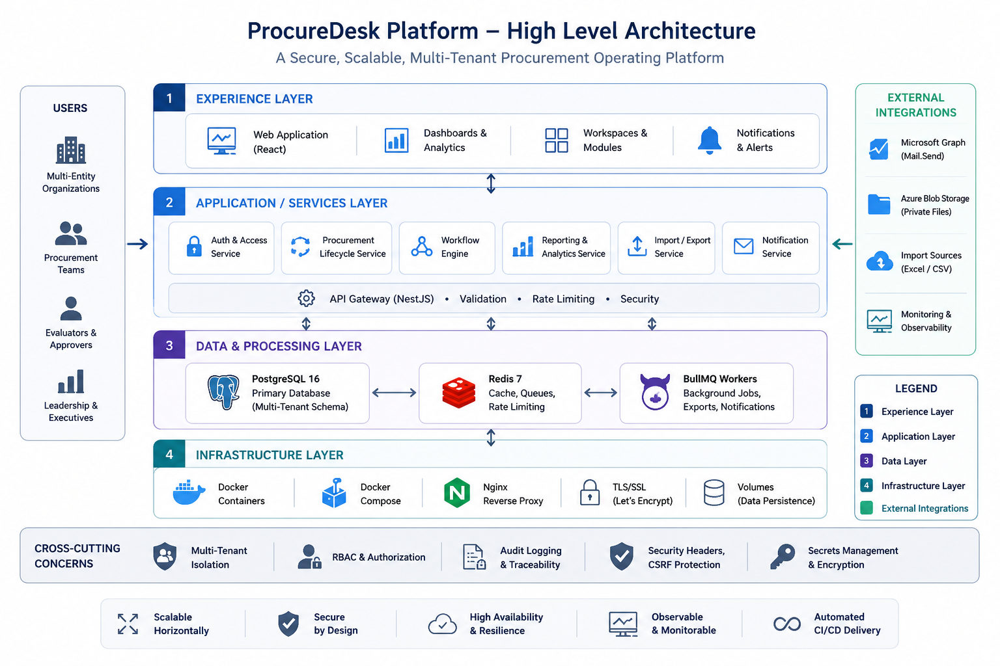
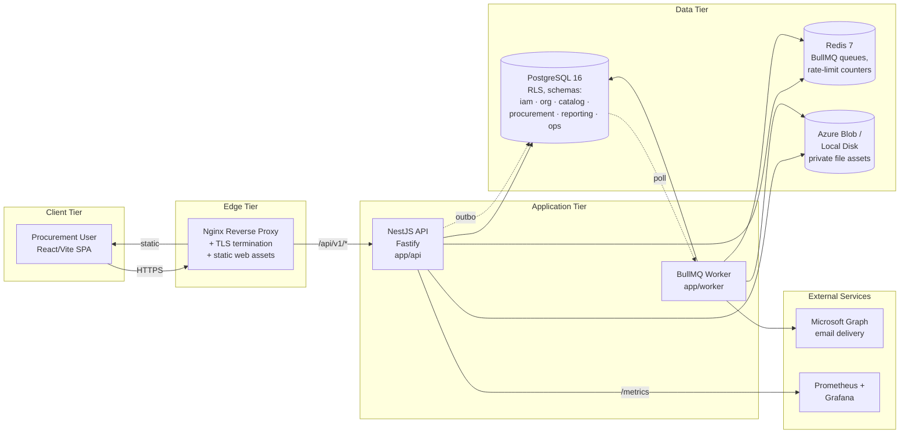
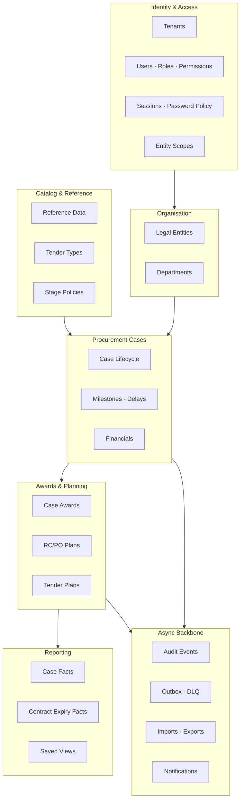
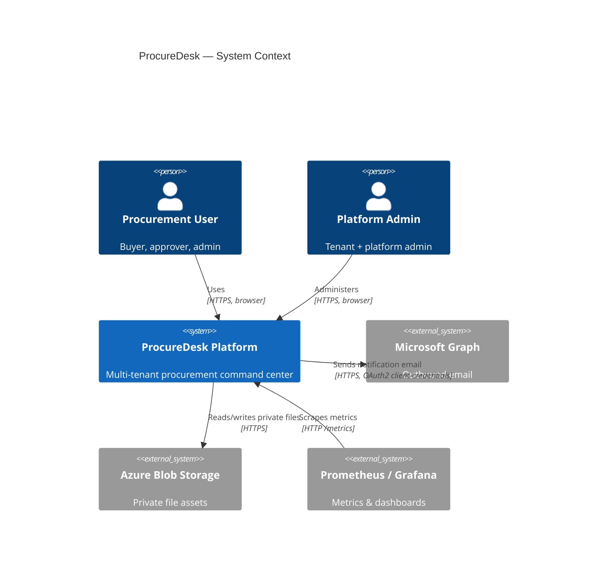
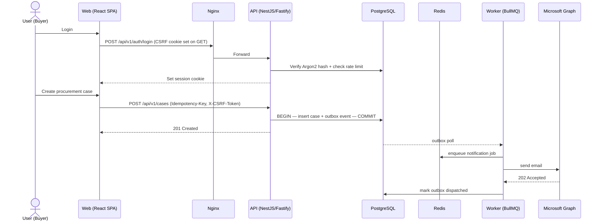

# 1. Executive Project Overview — ProcureDesk Platform

> Audience: CTO, Engineering Leadership, Product, Operations, Client/Vendor Handover.
> Status: Production-grade rebuild of the legacy Flask procurement workstation.
> Repository: `procuredesk-platform` (intentionally separate from the legacy codebase, which is reference-only).

---

## 1.1 Project Overview

**ProcureDesk Platform** is a multi-tenant, production-grade procurement command center built as a clean rebuild of an earlier Flask application. It centralises the end-to-end procurement lifecycle — from tender planning, through case execution and milestone tracking, into awards, contract/Rate-Contract & PO expiry monitoring, and management reporting — for organisations operating multiple legal entities and departments.

The platform replaces ad-hoc spreadsheet-driven procurement tracking with a structured, auditable system featuring role-based access, approval gates, asynchronous import/export pipelines, and email-based notifications delivered through Microsoft Graph.

## 1.2 Business Objective

| # | Objective | Outcome |
|---|-----------|---------|
| 1 | Replace error-prone spreadsheet workflows for procurement case tracking | Single source of truth per tenant, with audit trail |
| 2 | Provide visibility into tender pipelines, awards, and contract expiry to procurement leadership | Reporting layer with saved views and contract-expiry facts |
| 3 | Enforce multi-entity governance (departments, entities, role-based scopes) | IAM model with `user_entity_scopes` and RBAC |
| 4 | Reduce manual effort in onboarding bulk procurement records | Asynchronous Excel import/export pipelines |
| 5 | Deliver compliance-grade auditability of procurement decisions | Append-only `ops.audit_events` + outbox pattern |
| 6 | Enable safe migration off the legacy stack without disrupting current operations | Modular monolith with phased rollout per `PROCUREDESK_FULL_REBUILD_TODO_PLAN.md` |

## 1.3 Product Vision

ProcureDesk aspires to be the **procurement operating system** for mid-to-large RPSG group companies — a system where every procurement case has a defined lifecycle, every approval is logged, every contract expiry is foreseen, and every report is reproducible. Future iterations target supplier collaboration, e-tendering, and AI-assisted catalog and case insights.

## 1.4 Core Modules

The backend (NestJS modular monolith) is organised into domain modules — each owning its data, services, controllers, and workflows:

| Domain Module | Purpose |
|---------------|---------|
| `identity-access` | Tenants, users, roles, permissions, sessions, password lifecycle, login rate-limits |
| `organization` | Legal entities, departments, user-to-entity scopes |
| `catalog` | Reference data, tender types, completion rules, stage policies, tenant choice categories |
| `procurement-cases` | Case lifecycle, milestones, financials, delays, stage transitions |
| `awards` | Case awards, supplier selection, RC/PO plan linkage |
| `planning` | RC/PO plans, tender plan-to-case mapping |
| `reporting` | Case facts, contract-expiry facts, saved views, dashboards |
| `import-export` | Excel-based bulk import & export pipelines (Workers + Queues) |
| `notifications` | Notification rules, queued jobs, Microsoft Graph delivery |
| `operations` | Audit events, outbox dispatcher, file assets, idempotency |

## 1.5 Key Capabilities

- Multi-tenant isolation enforced at the database level (Row-Level Security — `db/migrations/committed/000002_rls.sql`).
- Strong session-based authentication with CSRF protection, Argon2 password hashing, and DB-backed login throttling.
- Idempotent mutating endpoints (`ops.idempotent_requests`) protecting against duplicate submissions.
- Asynchronous job processing for imports, exports, notifications, and reporting projections via BullMQ on Redis.
- Transactional outbox pattern (`ops.outbox_events` → `ops.dead_letter_events`) for reliable async dispatch.
- Excel ingest/egress using `exceljs`, with per-row failure tracking in `ops.import_job_rows`.
- Pluggable private object storage (local filesystem in dev / Azure Blob in production).
- Email delivery via Microsoft Graph (application permissions, app-only token).
- Strict TypeScript across API, Web, Worker, and shared packages with Zod-validated environment.
- Production observability via Prometheus metrics (`prom-client`), structured pino logs, and Grafana dashboards (`infra/monitoring/grafana`).

## 1.6 High-Level Architecture

*Figure 1.1 — Layered architecture: Experience · Application & Services · Data & Processing · Infrastructure, with multi-persona access on the left and external integrations on the right. Cross-cutting controls (tenant isolation, RBAC, audit, CSRF, secrets) and platform outcomes (scalability, security, observability, CI/CD) are summarised at the foot of the diagram.*

## 1.7 Technology Stack

| Layer | Technology |
|-------|-----------|
| Frontend | React 19, Vite 6, TanStack Router, TanStack Query, Tailwind utility merge, Lucide icons |
| API | NestJS 10 on Fastify (`@nestjs/platform-fastify`), Zod validation, Argon2, Helmet, fastify-cookie, fastify-multipart |
| Worker | Node 22, BullMQ 5, ioredis, pg, exceljs, pino |
| Shared Packages | `@procuredesk/contracts`, `@procuredesk/domain-types`, `@procuredesk/ui`, `@procuredesk/config`, `@procuredesk/eslint-config`, `@procuredesk/tsconfig` |
| Database | PostgreSQL 16 (Row-Level Security per tenant) |
| Cache / Queue | Redis 7 (AOF persistence, `noeviction` policy) |
| Object Storage | Azure Blob Storage (production) / Local FS (development) |
| Email | Microsoft Graph (application permissions) |
| Build / Tooling | pnpm 9 workspaces, TypeScript 5.7, ESLint 9, Prettier 3, Vitest |
| Containerisation | Docker, docker-compose (local + production) |
| Reverse Proxy | Nginx 1.27 (TLS via Let's Encrypt) |
| CI/CD | GitHub Actions (Gitleaks, pnpm audit, type-check/lint/test, Docker build, Trivy CVE scan) |
| Observability | Prometheus + Grafana, structured pino logs |

## 1.8 Major Integrations

| Integration | Protocol | Purpose | Failure Mode |
|-------------|----------|---------|--------------|
| Microsoft Graph (Mail) | HTTPS / OAuth2 client-credentials | Notification email delivery | Graceful — worker logs and disables notification consumer if env not configured |
| Azure Blob Storage | HTTPS / SAS or connection string | Private storage for uploads & generated exports | Falls back to local FS driver in non-prod |
| PostgreSQL | TCP/SSL | System of record | API health probe fails → orchestrator restarts |
| Redis | TCP | Queues + rate-limit counters | Rate-limiter fails open (login throttle is DB-backed); queue worker retries |

## 1.9 Deployment Environments

| Environment | Compose / Stack | Purpose | Notes |
|-------------|-----------------|---------|-------|
| **Local** | `infra/docker/docker-compose.yml` | Developer workstation | Postgres on `:55433`, Redis on `:56379`, hot-reload `pnpm dev` |
| **Dev / QA** | Shared developer instance | Internal validation | Same compose topology, scaled-down resources |
| **Staging** | `infra/deploy/staging-compose.yml` + GitHub Actions `deploy-staging.yml` | Pre-production verification, migration rehearsal | Deploys via `workflow_dispatch` with image tags |
| **Production** | `infra/deploy/production-compose.yml` on CLM server (see `docs/07-procuredesk-production-deployment-on-clm-server.md`) | Customer-facing | Real Azure Blob, real Microsoft Graph, real TLS |

## 1.10 Scalability Strategy

- **Horizontal API scaling**: API is stateless (sessions are DB-backed in `iam.sessions`, rate-limit counters in Redis). Replicas can scale linearly behind Nginx.
- **Worker scaling**: BullMQ workers scale per-queue (imports, exports, notifications, reporting-projections). Independent scaling per workload.
- **Database**: Single primary today; read-replica capable due to clean separation of write paths in services. Reporting projections move heavy aggregation off the OLTP hot path.
- **Caching**: Redis used for ephemeral counters today; identified extension points for read-cache on catalog/reference data.
- **Storage**: Azure Blob scales independently of the application tier.

## 1.11 Security Approach

- **Defense in depth at the platform edge**: Helmet CSP, TLS at Nginx, request-body size limits, multipart limits, Redis-backed global rate limit (120 req/min/IP), per-login DB throttle.
- **Authentication**: Server-rendered sessions stored in `iam.sessions`, signed cookies (HttpOnly, SameSite), CSRF double-submit token validated on every mutating request.
- **Authorization**: RBAC via `iam.roles` × `iam.permissions` × `iam.role_permissions`; tenant + entity scoping via `iam.user_entity_scopes`.
- **Data isolation**: PostgreSQL Row-Level Security policies (`000002_rls.sql`) enforce tenant boundaries even on direct DB access.
- **Secrets management**: Strict Zod env schema rejects placeholder values in non-dev environments; production env file lives at `/etc/procuredesk/.env.production` outside the repo.
- **Supply chain**: Gitleaks pre-build, `pnpm audit` (high+), Trivy CVE scan on every Docker image.

## 1.12 AI / LLM Overview

The current production scope **does not** ship LLM features. The architecture leaves a clean seam for future AI-assisted capabilities (case-summary generation, smart catalog suggestion, contract expiry insights). When introduced, these will live as a new domain module behind the same RBAC, with prompt/output logging routed through the existing audit + outbox patterns.

## 1.13 Operational Readiness

- Liveness & readiness HTTP probes (`/api/v1/healthz`, `/api/v1/ready`) wired into compose health checks.
- Prometheus metrics endpoint (`/api/v1/metrics`).
- Pino structured JSON logs in production (pretty in dev).
- Grafana dashboard scaffolding under `infra/monitoring/grafana`.
- Reproducible DB migrations under `db/migrations` (immutable + `committed/` chain).
- One-command local bring-up (`pnpm docker:up && pnpm dev`).
- Documented production deployment runbook (`docs/07-procuredesk-production-deployment-on-clm-server.md`) and per-feature runbook (`docs/08-feature-deployment-runbook.md`).

## 1.14 Risks & Mitigations

| # | Risk | Likelihood | Impact | Mitigation |
|---|------|-----------|--------|-----------|
| R1 | Single Postgres instance is a single point of failure | Med | High | Add managed Postgres with failover replica before scale-out (RDS / Azure DB) |
| R2 | Microsoft Graph quota or token failure halts notifications | Low | Med | Worker isolates notifications queue; outbox + DLQ retain undelivered events; alert on DLQ growth |
| R3 | Long-running imports could saturate worker capacity | Med | Med | Per-queue worker scaling; per-row failure isolation in `ops.import_job_rows` |
| R4 | Secret leakage from env file on production host | Low | High | Env at `/etc/procuredesk/.env.production` (`0600`, root-owned); Gitleaks in CI; weak-secret rejection at boot |
| R5 | RLS misconfiguration could expose cross-tenant data | Low | Critical | Enforced in migration `000002_rls.sql`; integration tests should pin policies |
| R6 | Worker outbox lag during incidents | Med | Med | DLQ table + Grafana alert on outbox event age |
| R7 | Schema drift between staging and production | Low | High | Migrations applied via CI deploy job using same SQL files as local |
| R8 | Browser session theft | Low | High | HttpOnly + SameSite cookies, 2h session TTL, 30-min idle timeout |

## 1.15 Future Roadmap

| Phase | Focus | Status |
|-------|-------|--------|
| Phase 1 — Foundation | Monorepo, API/Web/Worker shells, IAM, audit, outbox | Done |
| Phase 2 — Procurement Cases | Case lifecycle, milestones, financials | Done |
| Phase 3 — Awards & Planning | Awards, RC/PO plans, tender plan linkage | Done (recent commits) |
| Phase 4 — Reporting | Case facts, contract expiry facts, saved views | In progress |
| Phase 5 — Imports/Exports | Excel pipelines + per-row reconciliation | Done |
| Phase 6 — Notifications | Microsoft Graph email delivery | Done |
| Phase 7 — Production hardening | Observability, RLS, secret hygiene, CVE scanning | In progress |
| Phase 8 (Future) | Supplier collaboration portal, e-tendering | Backlog |
| Phase 9 (Future) | AI-assisted catalog & case insights | Backlog |
| Phase 10 (Future) | Managed Postgres + replica + connection pooling | Backlog |

## 1.16 Team Ownership Structure

| Area | Primary Owner | Secondary |
|------|---------------|-----------|
| Backend (API + Worker) | Backend Lead | Platform Eng. |
| Frontend (Web) | Frontend Lead | Backend Lead |
| Database & Migrations | Backend Lead | DevOps |
| Infrastructure & Deploy | DevOps Lead | Backend Lead |
| Security & Compliance | Security Lead | DevOps |
| Product & Workflow | Product Owner | Procurement SMEs |

---

## 1.17 Platform Capability Map

## 1.18 System Context Diagram

## 1.19 User Interaction Flow (Happy Path)

---

*End of Executive Project Overview.*
