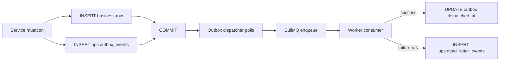
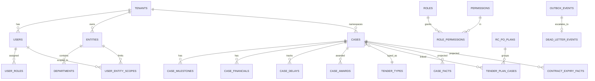
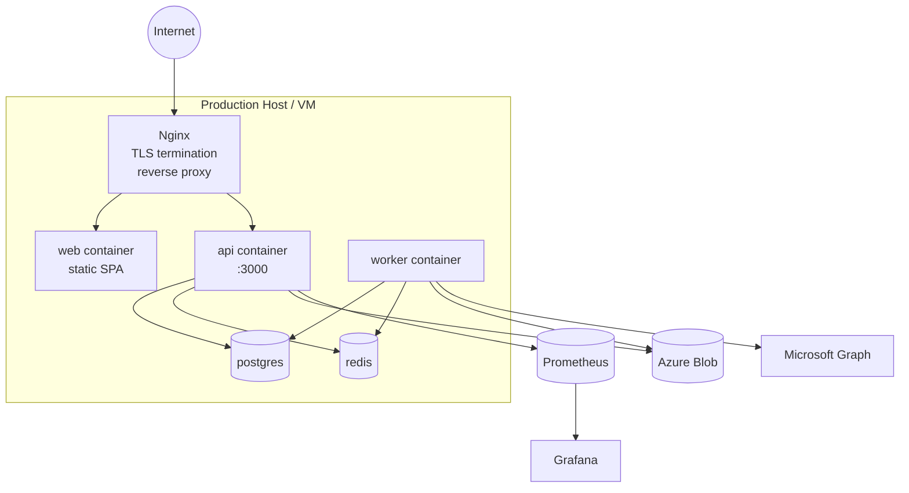
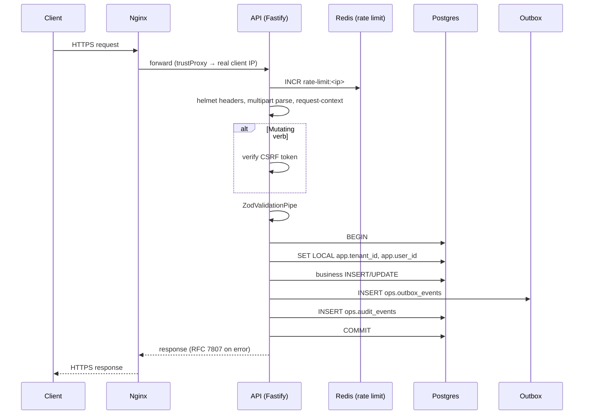
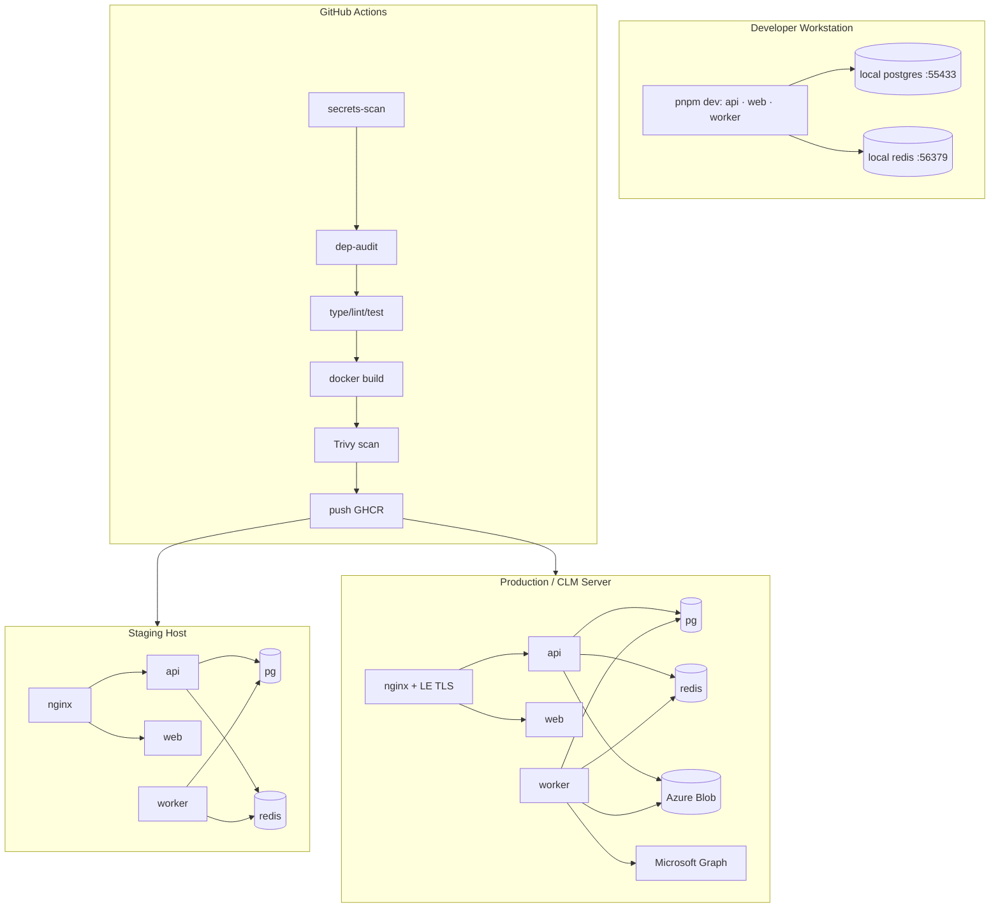
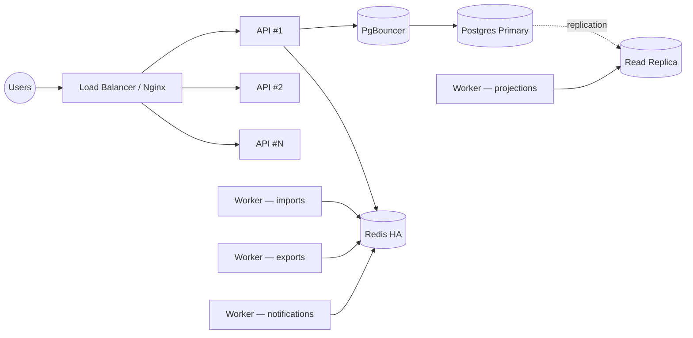
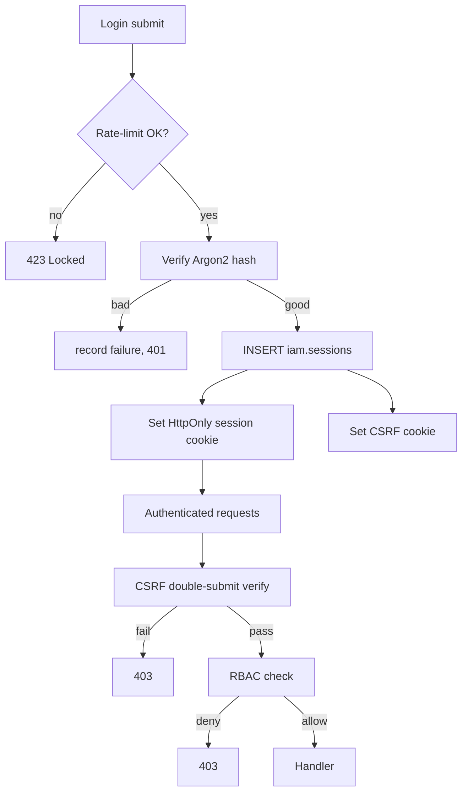

# 2. Complete System Architecture — ProcureDesk Platform

> Audience: Principal Engineers, Architects, Tech Leads, Senior Engineers.
> Scope: end-to-end architectural reference covering style, components, frontend, backend, DB, infra, security, scalability, and ADRs.

---

## 2.1 Architecture Overview

### 2.1.1 Architectural Style

ProcureDesk is a **modular monolith** backend with a **dedicated background worker process**, a **single-page React frontend**, and a **shared contract package** binding them. Concretely:

- One deployable API (`@procuredesk/api`) hosting all business modules under a single NestJS application.
- One deployable Worker (`@procuredesk/worker`) hosting all BullMQ consumers (imports, exports, notifications, reporting projections, outbox dispatch).
- One deployable Web (`@procuredesk/web`) static SPA served by Nginx.
- Shared TypeScript packages (`contracts`, `domain-types`, `ui`, `config`) compile-checked across the workspace.

### 2.1.2 Why Modular Monolith (Not Microservices)

| Criterion | Decision |
|-----------|----------|
| Domain coupling | High — procurement, awards, planning, reporting share entities |
| Team size | Small dedicated team — coordination cost of microservices unjustified |
| Transactional integrity | Single Postgres database supports atomic cross-domain writes |
| Deployment complexity | Single-image rollout vs. service mesh — modular monolith wins |
| Future split path | Domain modules (`apps/api/src/modules/*`) are decoupled enough to extract later |

### 2.1.3 Domain Boundaries

The modules under `apps/api/src/modules/` are the boundaries:

```
identity-access · organization · catalog ·
procurement-cases · awards · planning ·
reporting · import-export · notifications · operations · audit · outbox
```

Each module owns its services, controllers, repositories, and DTOs. Cross-module communication is **service injection**, not HTTP. Cross-module side effects (email, projections) are **decoupled via the outbox**.

### 2.1.4 Synchronous vs. Asynchronous Flows

| Flow | Type | Mechanism |
|------|------|-----------|
| User CRUD on cases / awards / plans | Sync | HTTP → API → Postgres (single transaction) |
| Authentication, authorisation | Sync | HTTP → API → Postgres + Redis |
| Bulk Excel import | Async | HTTP upload → enqueue `imports` job → Worker → per-row processing |
| Bulk Excel export | Async | HTTP request → enqueue `exports` job → Worker → file written to private storage → notification |
| Notification delivery | Async | API writes to outbox → outbox dispatcher → `notifications` queue → Microsoft Graph |
| Reporting projection refresh | Async | Outbox / scheduled → `reporting-projections` queue → Worker writes to `reporting.*` |
| Audit logging | Sync write, async aggregation | Append to `ops.audit_events` in same transaction as the change |

### 2.1.5 Caching & Storage Layers

| Layer | Technology | Purpose |
|-------|-----------|---------|
| Edge cache | Browser + Nginx static cache | SPA assets only |
| Application cache | Redis | Rate-limit counters, session-scoped data points (extension point) |
| Queue | Redis (BullMQ) | Imports / exports / notifications / projections |
| OLTP | PostgreSQL 16 | Source of truth, RLS-isolated per tenant |
| OLAP-lite | PostgreSQL `reporting.*` schema | Pre-projected facts for dashboards |
| Object storage | Azure Blob (prod) / local FS (dev) | Uploaded files, generated exports |

---

## 2.2 Component Breakdown

### 2.2.1 API Service (`apps/api`)

- **Purpose**: HTTP entrypoint for all user interactions and admin operations.
- **Responsibility**: Authentication, authorisation, validation, business logic orchestration, persistence, audit, outbox writes.
- **Dependencies**: PostgreSQL, Redis, Azure Blob (or local FS).
- **Scaling**: Stateless; scale horizontally behind Nginx. Sessions in DB, rate counters in Redis.
- **Failure scenarios**:
  - DB down → readiness probe fails → orchestrator stops routing traffic.
  - Redis down → global rate-limit fails open (DB-backed login throttle still protects the auth endpoint).
- **Retry strategy**: Inbound — none (clients retry idempotent requests using `Idempotency-Key`). Outbound DB — short retries via `pg` pool, otherwise surface as 5xx.
- **Security**: Helmet CSP, CSRF double-submit, Argon2, signed cookies, body size limit, multipart limits, `trustProxy`, problem-details RFC 7807 errors.

### 2.2.2 Worker Service (`apps/worker`)

- **Purpose**: Asynchronous job processing.
- **Responsibility**: Import, export, notification, reporting-projection consumption + outbox dispatch.
- **Dependencies**: PostgreSQL, Redis, Azure Blob, Microsoft Graph (when configured).
- **Scaling**: Per-queue concurrency; multiple worker pods can subscribe to the same queue (BullMQ guarantees one consumer per job).
- **Failure scenarios**:
  - Microsoft Graph token failure → notifications retry per BullMQ default; eventually moved to DLQ.
  - DB transient failure → BullMQ retries; persistent failure → DLQ.
- **Retry strategy**: BullMQ exponential backoff, max attempts capped via `OUTBOX_MAX_ATTEMPTS=5`. Failed events captured in `ops.dead_letter_events`.

### 2.2.3 Web Application (`apps/web`)

- **Purpose**: User-facing SPA.
- **Responsibility**: Render screens, drive API calls, manage client state.
- **Dependencies**: API service.
- **Scaling**: Statically served via Nginx; trivially CDN-able.
- **Failure scenarios**: Network errors surface via TanStack Query; offline state displayed.

### 2.2.4 Reverse Proxy (Nginx)

- **Purpose**: TLS termination, request routing, static asset serving, rate-limit edge.
- **Configuration**: `infra/nginx/procuredesk.conf` mounted into `nginx:1.27-alpine`.
- **Failure scenarios**: Container restart; health-check `/health` polled by orchestrator.

### 2.2.5 PostgreSQL

- **Purpose**: System of record.
- **Schemas**: `iam`, `org`, `catalog`, `procurement`, `reporting`, `ops`.
- **Scaling**: Vertical first; read-replica route for reporting later.
- **Backup**: Out-of-band scheduled `pg_dump` to encrypted off-host storage; full + WAL retention per RPO target.

### 2.2.6 Redis

- **Purpose**: BullMQ queues + Redis-backed rate limiting.
- **Configuration**: AOF persistence, `noeviction` policy (queues must not be silently dropped).
- **Scaling**: Single primary today; Redis Sentinel/Cluster acceptable for HA.

### 2.2.7 Object Storage

- Local FS in dev (`/tmp/procuredesk/private`).
- Azure Blob in production via `PRIVATE_STORAGE_DRIVER=azure_blob` + `AZURE_BLOB_CONNECTION_STRING`.

---

## 2.3 Frontend Architecture

### 2.3.1 App Structure

```
apps/web/src/
  app/         routing shell, providers, layout
  features/    admin · auth · awards · dashboard · import-export ·
               operations · planning · procurement-cases · profile · reporting
  shared/      cross-feature components, hooks, API client
  styles.css   Tailwind + design tokens
```

### 2.3.2 Rendering Strategy

- Pure client-side rendering (Vite-built SPA).
- Static assets served by Nginx (`infra/docker/web.Dockerfile`).
- No SSR — auth gating done at the API; SPA treats failed auth as a redirect to `/login`.

### 2.3.3 Routing

- TanStack Router with feature-co-located route definitions.
- Layout-level guards check session via `/api/v1/auth/me`.

### 2.3.4 State Management

- **Server state**: TanStack Query (cache, invalidation, optimistic updates).
- **Local UI state**: React component state.
- No global store — server state replaces it.

### 2.3.5 API Communication

- `fetch`-based client wrapper in `shared/`, attaches `X-CSRF-Token` (mirrored from cookie) on mutating requests.
- Errors shaped as RFC 7807 problem-details and converted to typed React errors.

### 2.3.6 Auth Flow (Frontend)

1. Unauthenticated user lands → router redirects to `/login`.
2. `GET /api/v1/auth/csrf` (if needed) seeds the CSRF cookie.
3. `POST /api/v1/auth/login` with credentials.
4. On 200, session cookie set by server; SPA fetches `/api/v1/auth/me` and routes to dashboard.

### 2.3.7 Optimisation Strategy

- Vite code-splitting per route.
- Tailwind purge via JIT.
- TanStack Query staleness windows tuned per resource (catalog data long, case data short).
- Future: HTTP cache headers from Nginx for static chunks; HTTP/2 push.

---

## 2.4 Backend Architecture

### 2.4.1 Layered Composition (per module)

```
controller (HTTP boundary, validation via Zod)
   ↓
service    (business rules, transactions, RBAC checks)
   ↓
repository (SQL via pg, parameter binding only)
   ↓
PostgreSQL
```

Side effects (audit, outbox, file writes) are encapsulated in **operations** services and called from domain services within the same transaction.

### 2.4.2 Validation Layer

- Inbound bodies validated with Zod schemas defined in `@procuredesk/contracts`.
- Failures throw typed errors converted to RFC 7807 problem-details by `ProblemDetailsFilter`.

### 2.4.3 Transaction Boundaries

- One DB transaction per mutating HTTP request, opened in the service layer.
- Outbox writes occur **inside the same transaction** as the business write (transactional outbox pattern) — guarantees no event is dispatched for a rolled-back change.

### 2.4.4 Background Jobs

- Started in `apps/worker/src/main.ts`.
- Queues: `imports`, `exports`, `notifications`, `reporting-projections`.
- Outbox dispatcher polls `ops.outbox_events` every `OUTBOX_POLLING_INTERVAL_MS` (default 10 s) and enqueues onto the appropriate BullMQ queue.

### 2.4.5 Schedulers

- Outbox dispatcher loop is the only built-in scheduler today.
- Cron-style jobs (e.g. nightly contract-expiry projection) are slated as future work, to be implemented as a recurring BullMQ job.

### 2.4.6 Event Handling



---

## 2.5 Database Architecture

### 2.5.1 Schemas & Tables (selected)

| Schema | Tables (representative) |
|--------|------------------------|
| `iam` | `tenants`, `users`, `password_policies`, `password_history`, `roles`, `permissions`, `role_permissions`, `user_roles`, `user_entity_scopes`, `sessions` |
| `org` | `entities`, `departments` |
| `catalog` | `reference_categories`, `reference_values`, `tender_types`, `tender_type_completion_rules`, `stage_policies` |
| `procurement` | `cases`, `case_financials`, `case_milestones`, `case_delays`, `case_awards`, `rc_po_plans`, `tender_plan_cases` |
| `reporting` | `case_facts`, `contract_expiry_facts`, `report_saved_views` |
| `ops` | `audit_events`, `outbox_events`, `dead_letter_events`, `file_assets`, `import_jobs`, `import_job_rows`, `export_jobs`, `notification_rules`, `notification_jobs`, `idempotent_requests`, `login_rate_limits` |

### 2.5.2 Conceptual ER (high-level)



### 2.5.3 Indexing Strategy

- Defined in `db/migrations/committed/000004_indexes.sql`.
- B-tree indexes on every foreign key and on common filter columns (`tenant_id`, `entity_id`, status enums, `created_at`, expiry windows).
- Partial indexes for active/open cases and for non-dispatched outbox events.

### 2.5.4 Partitioning & Archival

- Today: no partitioning; expected case volume per tenant fits comfortably in single tables.
- Roadmap: time-partition `ops.audit_events` and `ops.outbox_events` quarterly once volume warrants; archive older partitions to cold storage.

### 2.5.5 Audit Strategy

- Append-only `ops.audit_events` row per state-changing action; written inside the same transaction.
- Includes `tenant_id`, `actor_user_id`, `action`, `target_type`, `target_id`, `payload jsonb`, `ip_address`, `user_agent`, `request_id`, `at`.

### 2.5.6 Tenant Isolation

- Row-Level Security policies enabled in `000002_rls.sql`.
- Application sets `set_config('app.tenant_id', ..., true)` per request via the database service; policies enforce `tenant_id = current_setting('app.tenant_id')::uuid`.

---

## 2.6 Infrastructure Architecture



- **Networking**: Containers communicate via the docker-compose default bridge network. Only Nginx exposes 80/443 externally. PG and Redis remain on the internal network.
- **DNS**: Public hostname → CLM server → Nginx; certificate via Let's Encrypt mounted from `/etc/letsencrypt`.
- **Backups**: Postgres backed up via host-level scheduled `pg_dump`; Azure Blob redundancy is provider-managed (LRS/GRS as configured).
- **Autoscaling**: N/A on single-host compose; Kubernetes path described in §2.10.

---

## 2.7 Security Architecture

### 2.7.1 Authentication & Authorisation

- Argon2id password hashing with policy table (`iam.password_policies`) per tenant.
- DB-backed login throttle (`ops.login_rate_limits`) with configurable lockout window.
- Session cookies signed with `SESSION_SECRET`; 2-hour TTL, 30-minute idle timeout.
- CSRF double-submit token verified on every non-safe verb (`apps/api/src/main.ts`).

### 2.7.2 RBAC

- `iam.permissions` define atomic capabilities (e.g. `case.read`, `case.update`, `award.create`).
- `iam.roles` aggregate permissions; users get roles via `iam.user_roles`.
- Entity-level scoping: `iam.user_entity_scopes` constrains which entities/departments a user can act on.
- Access level granularity introduced by `000008_user_access_level.sql` (admin / standard / read-only).

### 2.7.3 Token Flow

```mermaid
sequenceDiagram
    actor U as User
    participant W as Web
    participant A as API
    participant DB as Postgres
    U->>W: enter credentials
    W->>A: POST /auth/login
    A->>DB: SELECT user, verify Argon2
    A->>DB: INSERT iam.sessions
    A-->>W: Set-Cookie session=<signed>; Set-Cookie csrf=<token>
    W->>A: subsequent request with X-CSRF-Token + cookie
    A->>A: verify CSRF (constant-time compare)
    A->>DB: lookup session, set app.tenant_id
```

### 2.7.4 Secret Management

- Local: `.env` (git-ignored).
- Production: `/etc/procuredesk/.env.production`, root-owned, mode `0600`.
- Boot-time validation rejects placeholder substrings (`change-me`, `replace-with`, `local-`, etc.) for `SESSION_SECRET` and `CSRF_SECRET` outside dev/test.

### 2.7.5 Encryption

- In transit: TLS 1.2+ at Nginx.
- At rest: Postgres data via host disk encryption; Azure Blob server-side encryption.
- Cookies signed (HMAC) but not encrypted — they carry only opaque session IDs.

### 2.7.6 API Protection

- Helmet CSP defaults restricted (`'self'` only; no inline script/style).
- 1 MB JSON body limit; multipart limited to 1 file, 10 fields, 100 header pairs.
- Global Redis-backed limit: 120 req/min/IP.

### 2.7.7 Network Isolation

- DB and Redis are unreachable from outside the host (no host port exposure in production compose).
- Worker has no inbound listeners.

### 2.7.8 Tenant Isolation

- Postgres RLS as enforcement of last resort.
- Service-level checks on `tenant_id` for every query.

---

## 2.8 AI / LLM Architecture

Not in current scope. Reserved seam: a future `ai-insights` module would consume from `ops.outbox_events`, run prompts via a vendor SDK, persist outputs to a dedicated `ai.*` schema, and route through audit + RBAC like any other module.

---

## 2.9 Scalability Design

| Dimension | Today | Path Forward |
|-----------|-------|-------------|
| API horizontal | 1 container | Add replicas; shared session in DB, shared rate counter in Redis — no code change |
| API vertical | 256 Mi reserved / 512 Mi limit | Tune via compose `deploy.resources` |
| Worker | 1 process running all queues | Split into per-queue worker deployments; raise BullMQ concurrency |
| DB | Single primary | Move to managed Postgres with read replica; route reporting reads to replica |
| Cache / Queue | Single Redis | Redis Sentinel for HA; BullMQ supports cluster |
| Storage | Azure Blob | Already horizontally infinite |

### 2.9.1 Expected Bottlenecks

1. PostgreSQL connections — `pg.Pool` capped to 10 per worker; tune `max` and add PgBouncer for many-replica deployments.
2. BullMQ Redis bandwidth at very high import volumes.
3. Reporting projection latency — mitigate via replica reads + batched projections.

---

## 2.10 Failure Handling

| Failure | Handling |
|---------|---------|
| Transient DB error | Service surfaces 5xx; clients retry idempotent calls with `Idempotency-Key` |
| Redis outage | Global rate limit fails open; login throttle still enforced via DB; queues halt until restored (jobs queue in API memory? — no, API enqueues only on commit; backpressure surfaces as 5xx) |
| Microsoft Graph error | BullMQ retries with backoff; persistent failure → `ops.dead_letter_events` |
| Worker crash | Container restart policy `unless-stopped`; BullMQ resumes pending jobs |
| Outbox dispatcher stall | Grafana alert on `max(now() - outbox.created_at) where dispatched_at is null` |
| Bad import row | Recorded in `ops.import_job_rows.error_message`; rest of file proceeds |

---

## 2.11 Architecture Decision Records (ADRs)

### ADR-001 — Modular Monolith over Microservices
- **Decision**: Single API + single worker, modular by domain.
- **Rationale**: Small team, high domain coupling, single Postgres for transactional integrity.
- **Alternatives considered**: Microservices per domain (rejected — operational overhead); serverless functions (rejected — long-running imports).
- **Tradeoff**: Larger blast radius per deploy; mitigated by feature flags and per-feature deployment runbook.

### ADR-002 — Fastify over Express
- **Decision**: Use `@nestjs/platform-fastify`.
- **Rationale**: Higher throughput, native schema validation, built-in body limits.
- **Alternatives**: Express (rejected — slower, weaker default hardening).

### ADR-003 — Transactional Outbox over Direct Publish
- **Decision**: Persist `ops.outbox_events` in the same transaction as the business write; dispatcher polls.
- **Rationale**: At-least-once delivery without two-phase commit; survives Redis outage.
- **Alternatives**: Synchronous publish (rejected — lost messages on Redis hiccup).

### ADR-004 — PostgreSQL Row-Level Security for Tenant Isolation
- **Decision**: RLS as enforcement floor.
- **Rationale**: Defence in depth even if a service-layer check is missed.
- **Alternatives**: Schema-per-tenant (rejected — operationally heavy); app-only filtering (rejected — no defence in depth).

### ADR-005 — BullMQ on Redis for Async Jobs
- **Decision**: BullMQ queues for imports, exports, notifications, projections.
- **Rationale**: Mature retries, DLQ semantics, low operational burden.
- **Alternatives**: RabbitMQ (rejected — extra infra); pg-based queue (rejected — less mature).

### ADR-006 — Excel as Bulk Import/Export Format
- **Decision**: `exceljs` for parsing/generation.
- **Rationale**: Procurement users live in Excel; CSV insufficient for typed cells & multiple sheets.
- **Tradeoff**: Higher memory per job — mitigated by per-row streaming where possible.

### ADR-007 — Server-Rendered Sessions over JWT
- **Decision**: Signed cookie + DB session row.
- **Rationale**: Server-side revocation, idle timeout, no client-side token sprawl.
- **Alternatives**: JWT (rejected — revocation complexity).

---

## 2.12 API Request Lifecycle (Sequence Diagram)



## 2.13 Deployment Diagram



## 2.14 Scaling Diagram



## 2.15 Auth Flow Diagram



---

*End of System Architecture.*
