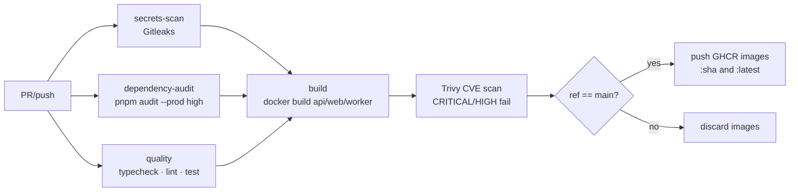
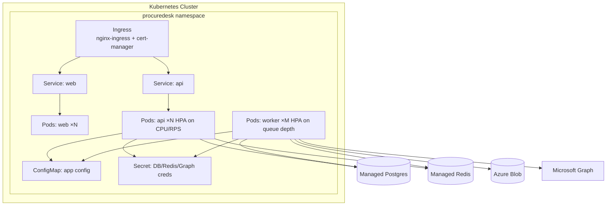
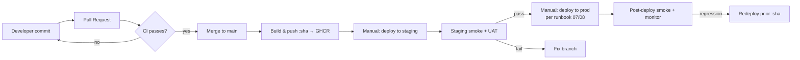
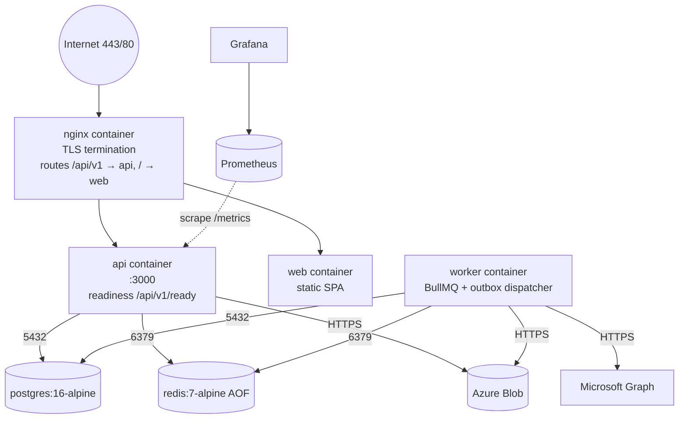

# 3. DevOps, Infrastructure & Deployment — ProcureDesk Platform

> Audience: SRE, DevOps engineers, Release Managers, On-call.
> Scope: environments, CI/CD, infrastructure topology, deploy/rollback, observability, backups, hardening, production checklist.

---

## 3.1 Environment Strategy

| Environment | Hostname / Stack | Compose / Source of Truth | Data | Audience | Promote From |
|-------------|------------------|---------------------------|------|----------|--------------|
| **Local** | `localhost` | `infra/docker/docker-compose.yml` | Throwaway local DB seeded by `pnpm db:bootstrap:local` | Developers | n/a |
| **Dev / QA** | shared dev VM | same compose template, scaled-down | Refreshed weekly | Engineering, QA | Local |
| **Staging** | `staging.procuredesk.<domain>` | `infra/deploy/staging-compose.yml` + `.github/workflows/deploy-staging.yml` | Anonymised snapshot of production | Engineering, UAT | Dev/QA |
| **Production** | `procuredesk.<domain>` | `infra/deploy/production-compose.yml` on CLM server | Real customer data | End users | Staging |

**Promotion rule**: changes flow `local → dev/qa → staging → production`. No direct push to production. All migrations rehearsed in staging.

---

## 3.2 CI/CD Architecture

Source: `.github/workflows/ci.yml` and `.github/workflows/deploy-staging.yml`.

### 3.2.1 Pipeline Stages (CI on every PR + main push)



### 3.2.2 Build Flow

- Node 22, pnpm via Corepack.
- `pnpm install --frozen-lockfile` (falls back to non-frozen if lock missing).
- `pnpm -r typecheck`, `pnpm -r lint`, `pnpm test` for `@procuredesk/api` and `@procuredesk/worker`.

### 3.2.3 Image Build

- Three Dockerfiles under `infra/docker/`:
  - `api.Dockerfile` — multi-stage, non-root user.
  - `web.Dockerfile` — builds Vite app, copies to Nginx-served static layer.
  - `worker.Dockerfile` — multi-stage, non-root user.
- Tags: `ghcr.io/<org>/<repo>/procuredesk-{api,web,worker}:{sha,latest}`.

### 3.2.4 Deployment Flow (Staging)

- Triggered manually via `workflow_dispatch` with the three image tags.
- Steps:
  1. Apply DB migrations (`db/migrations/0001_foundation.sql`) and seeds (`db/seeds/0001_reference_data.sql`).
  2. Roll out new images (target-platform-specific command — placeholder in workflow).
- Production replicates this pattern with stricter approval (see §3.4).

### 3.2.5 Rollback Strategy

- Workflow `.github/workflows/rollback-staging.yml` re-runs the deploy with a previous known-good image tag (and its corresponding migration baseline).
- DB migrations are forward-only — rollback policy is to **roll forward** rather than revert schema. Backward-compatible migrations are required (see §3.4).

### 3.2.6 Release Management

- Source of truth: GHCR `:sha` tag (immutable). `:latest` is informational.
- Release notes derived from PR titles since previous tag.
- Per-feature deployment runbook: `docs/08-feature-deployment-runbook.md`.

---

## 3.3 Infrastructure Setup

### 3.3.1 Servers / Compute

- Production today runs on a single CLM server (see `docs/07-procuredesk-production-deployment-on-clm-server.md`).
- All processes run as Docker containers under docker-compose.
- Future: container orchestration on Kubernetes (cluster shape sketched in §3.5).

### 3.3.2 Containers

| Image | Purpose | Resource limits (compose) |
|-------|---------|---------------------------|
| `procuredesk-api` | NestJS HTTP service on `:3000` | 256 Mi reserved / 512 Mi limit |
| `procuredesk-worker` | BullMQ workers + outbox dispatcher | 256 Mi reserved / 512 Mi limit |
| `procuredesk-web` | Static SPA | (no explicit limit) |
| `nginx:1.27-alpine` | Reverse proxy + TLS | (no explicit limit) |
| `postgres:16-alpine` | Primary DB | host-managed |
| `redis:7-alpine` | Queues + counters | host-managed |

### 3.3.3 Networking

- Compose default bridge isolates DB and Redis from the host network.
- Only Nginx publishes ports `80` and `443`.
- TLS certificates mounted from `/etc/letsencrypt`.

### 3.3.4 Storage

- **Postgres**: docker-named volume `postgres-data` (or host bind-mount in production).
- **Redis**: AOF persistence on volume `redis-data`.
- **Application files**: Azure Blob Storage container `procuredesk-private` in production, local `/var/lib/procuredesk/private` otherwise.

### 3.3.5 Secrets

- **Local**: `.env` (git-ignored).
- **Staging**: GitHub Actions environment secrets (`STAGING_DATABASE_URL`, etc.).
- **Production**: `/etc/procuredesk/.env.production` mounted into containers via `env_file:` in `production-compose.yml`. Mode `0600`, root-owned. Never committed.

### 3.3.6 IAM

- Microsoft Graph application registration with `Mail.Send` application permission, scoped to `MS_GRAPH_SENDER_MAILBOX`.
- Azure Blob via connection string (recommended: rotate to managed identity in future hardening).
- GitHub Actions uses the workflow's `GITHUB_TOKEN` for GHCR push.

---

## 3.4 Deployment Process — Step-by-step

> The canonical reference is `docs/07-procuredesk-production-deployment-on-clm-server.md` and the per-feature runbook `docs/08-feature-deployment-runbook.md`. The summary below is the operational shape.

### 3.4.1 Pre-flight (off-host)

1. Confirm CI is green on the target SHA.
2. Confirm staging has the candidate images deployed and smoke-tested.
3. Open change ticket; identify operator-on-call.
4. Verify `/etc/procuredesk/.env.production` is current (rotated secrets, Graph creds present, storage driver `azure_blob`).

### 3.4.2 Database Migration

```bash
# Apply baseline + any committed migrations idempotently.
psql "$DATABASE_URL" -v ON_ERROR_STOP=1 -f db/migrations/0001_foundation.sql
for f in db/migrations/committed/*.sql; do
  psql "$DATABASE_URL" -v ON_ERROR_STOP=1 -f "$f"
done
```

> **Backward-compat rule**: any migration deployed must keep N-1 application code working until the new image is live. Drops happen in a follow-up migration cycle.

### 3.4.3 Image Rollout

```bash
export PROCUREDESK_API_IMAGE=ghcr.io/<org>/<repo>/procuredesk-api:<sha>
export PROCUREDESK_WORKER_IMAGE=ghcr.io/<org>/<repo>/procuredesk-worker:<sha>
export PROCUREDESK_WEB_IMAGE=ghcr.io/<org>/<repo>/procuredesk-web:<sha>

docker compose -f infra/deploy/production-compose.yml pull
docker compose -f infra/deploy/production-compose.yml up -d
```

### 3.4.4 Post-deploy verification

- `curl -fsS https://<host>/api/v1/healthz` and `/api/v1/ready` return 200.
- `docker compose ps` shows `healthy` for api/reverse-proxy.
- Spot-check Grafana for error-rate and latency baselines.
- Run smoke flow: login → list cases → create test case → confirm audit row in `ops.audit_events`.

### 3.4.5 Rollback

- Re-run §3.4.3 with the prior image SHA.
- If schema is incompatible, the prior image must remain compatible (see backward-compat rule). Otherwise: **roll forward** with a fix.

---

## 3.5 Kubernetes / Docker

### 3.5.1 Today — Docker Compose

Production stack in `infra/deploy/production-compose.yml`:

- `api` (env-file `/etc/procuredesk/.env.production`, healthcheck `/api/v1/ready`).
- `worker` (env-file shared).
- `web` (static).
- `reverse-proxy` (Nginx, depends on api healthy).

### 3.5.2 Tomorrow — Kubernetes Topology (recommended target)



### 3.5.3 Probes

- Liveness: `GET /api/v1/healthz` (process up, event loop responsive).
- Readiness: `GET /api/v1/ready` (DB and Redis reachable).
- Worker: liveness via simple TCP listener on a sidecar port, or `bullmq` heartbeat.

### 3.5.4 Autoscaling

- API HPA on CPU and request rate (Prometheus adapter).
- Worker HPA on **BullMQ queue depth** (custom metric exported by `prom-client`).

### 3.5.5 ConfigMaps & Secrets

- Non-sensitive config (URLs, feature flags) → ConfigMap.
- Sensitive (`SESSION_SECRET`, `CSRF_SECRET`, DB DSN, Graph client secret, Azure Blob connection string) → Secret (sealed-secrets / external-secrets recommended).

---

## 3.6 Monitoring & Observability

### 3.6.1 Metrics

- Prometheus scraped from API `/api/v1/metrics` (`prom-client`).
- Default Node.js process metrics + custom counters (HTTP RED metrics, queue depth, outbox lag).
- Grafana dashboards under `infra/monitoring/grafana`.

### 3.6.2 Logs

- Pino JSON in production, pino-pretty locally.
- Each log line includes `requestId`, `method`, `url`, plus event-specific fields.
- Recommended: ship via host log agent (Promtail / Fluent Bit) to Loki / Elasticsearch.

### 3.6.3 Tracing

- Not enabled today. Recommended: OpenTelemetry SDK with OTLP exporter to a central collector. Trace IDs threaded via `request-context.ts`.

### 3.6.4 Alerts (recommended baseline)

| Alert | Condition | Severity |
|-------|-----------|---------|
| API 5xx burst | `rate(http_requests_total{status=~"5.."}[5m]) > 1%` of total | critical |
| API p95 latency | `> 800 ms` for 10 min | warning |
| Outbox lag | `max(now()-created_at) where dispatched_at IS NULL > 5 min` | critical |
| DLQ growth | `increase(ops_dead_letter_events_total[15m]) > 0` | warning |
| Queue backlog | `bullmq_queue_waiting{queue="imports"} > 100` for 10 min | warning |
| DB connections | `pg_stat_activity > 80% of max_connections` | critical |
| Redis memory | `> 80% of maxmemory` | warning |
| Cert expiry | `< 14 days` | warning |

---

## 3.7 Backup & Recovery

### 3.7.1 Backup Strategy

| Asset | Method | Frequency | Retention |
|-------|--------|-----------|-----------|
| PostgreSQL | `pg_dump --format=custom` to encrypted off-host store | nightly | 30 days rolling + monthly snapshots 12 months |
| Postgres WAL | continuous archive (recommended add-on) | continuous | 7 days |
| Azure Blob | provider-managed redundancy (LRS minimum, GRS recommended) | continuous | aligned to Azure account policy |
| Configuration (`/etc/procuredesk/.env.production`, Nginx, certs) | host-level encrypted backup | weekly | 90 days |

### 3.7.2 Restore Process (DB)

1. Provision empty Postgres of matching version.
2. `pg_restore --clean --create -d postgres backup.dump`.
3. Apply any migrations newer than the backup.
4. Repoint application by updating `DATABASE_URL` in `/etc/procuredesk/.env.production`.
5. Run smoke tests (auth, list cases, create case).

### 3.7.3 Disaster Recovery — RPO / RTO Targets

| Target | Value | Notes |
|--------|-------|-------|
| RPO | 24 h (today) → 15 min (with WAL archiving) | gap closes once continuous archive is in place |
| RTO | 4 h (today) → 1 h (with managed DB failover) | bound by manual restore time |

---

## 3.8 Security Hardening

- **Firewall**: only 80/443 inbound; 22 restricted to bastion CIDR.
- **WAF**: Nginx-level rate limiting + recommended Cloudflare / Azure Front Door WAF in front.
- **DDoS**: rely on upstream provider; application-layer Redis-backed limit (120 req/min/IP) blunts low-rate floods.
- **IAM**: production secrets root-owned, mode `0600`; no shared logins to host.
- **Patching**: weekly `apt upgrade`; monthly base image rebuilds.
- **Vulnerability scans**: Trivy on every image build (CRITICAL/HIGH fail). Periodic `pnpm audit` outside CI.
- **Secrets scanning**: Gitleaks on every CI run.

---

## 3.9 Production Checklist

### 3.9.1 Pre-launch validation

- [ ] CI green on target SHA (Gitleaks, audit, type/lint/test, Trivy).
- [ ] All migrations applied and verified on staging with prod-shaped data.
- [ ] `/etc/procuredesk/.env.production` reviewed; no placeholder secrets; `MS_GRAPH_*` set; `PRIVATE_STORAGE_DRIVER=azure_blob` with valid connection string.
- [ ] TLS certificates valid > 30 days.
- [ ] Backups verified (last successful restore drill ≤ 90 days).
- [ ] Grafana dashboards reachable; alerts firing path tested.
- [ ] On-call paged primary identified; change window agreed.

### 3.9.2 Smoke tests (post-deploy)

- [ ] `/api/v1/healthz` and `/api/v1/ready` 200.
- [ ] Login as platform admin succeeds.
- [ ] Create test procurement case; confirm `ops.audit_events` row.
- [ ] Trigger a small Excel import; confirm `import_jobs` completes and rows land.
- [ ] Trigger an export; confirm file in private storage and notification dispatched.
- [ ] `prom-client` metrics scrape returns 200.

### 3.9.3 Rollback verification

- [ ] Image SHA of prior deploy known and pullable from GHCR.
- [ ] Schema is forward-compatible with prior image (or a documented rollback path exists).
- [ ] Operator able to redeploy prior image in < 10 min.

### 3.9.4 Monitoring validation

- [ ] Grafana shows live RED metrics within 5 min of deploy.
- [ ] Alert routes confirmed (test alert fires to on-call).

---

## 3.10 CI/CD & Release Lifecycle Diagram



## 3.11 Infrastructure Diagram (Production, current single-host)



---

*End of DevOps, Infrastructure & Deployment.*
