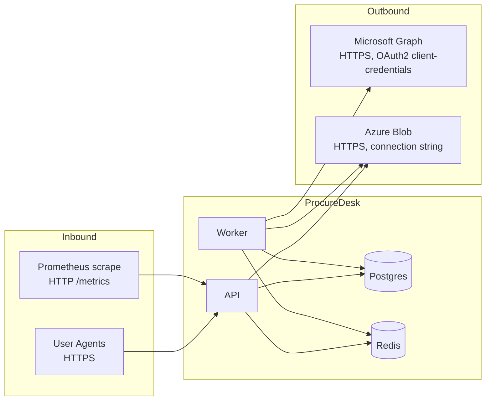
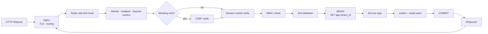

# 5. API & Integration Documentation — ProcureDesk Platform

> Audience: Backend engineers, integrators, frontend engineers consuming the API.
> Scope: contract standards, auth flow, representative endpoints, integrations, async event flows, error standards, security controls.

---

## 5.1 API Standards

| Concern | Standard |
|---------|----------|
| Base path | `/api/v1` (set via `app.setGlobalPrefix("api/v1")` in `apps/api/src/main.ts`) |
| Versioning | URL-segment major version (`/v1`); breaking changes ship as `/v2` |
| Naming | kebab-case URL segments; resource-noun pluralised (`/procurement-cases`, `/case-awards`) |
| Verbs | `GET` (read), `POST` (create), `PATCH` (partial update), `PUT` (full replace, rarely used), `DELETE` |
| Auth | Cookie session (`procuredesk_session`) + CSRF double-submit (`X-CSRF-Token` header) for mutating verbs |
| Pagination | `?limit=<int>&cursor=<opaque>` for list endpoints; response includes `next_cursor` |
| Sorting | `?sort=<field>` and `?order=asc|desc` |
| Filtering | Resource-specific query params; documented per endpoint |
| Errors | RFC 7807 `application/problem+json` |
| Idempotency | Mutating endpoints accept `Idempotency-Key` header; replays return the original response (`ops.idempotent_requests`) |
| Content type | `application/json` for body; `multipart/form-data` for file upload |
| Compression | `gzip` if client `Accept-Encoding` permits |
| Timestamps | RFC 3339 / ISO-8601 in UTC (`Z`) |
| IDs | UUIDv4 (server-generated) |

---

## 5.2 Authentication Flow

ProcureDesk uses **server-stored sessions** with **double-submit CSRF**. JWTs are not used.

### 5.2.1 Token / Session Lifecycle

```mermaid
sequenceDiagram
    actor U as User
    participant W as Web (SPA)
    participant A as API
    participant DB as Postgres

    U->>W: Open app
    W->>A: GET /api/v1/auth/csrf
    A-->>W: Set-Cookie procuredesk_csrf=<token>
    U->>W: Submit credentials
    W->>A: POST /api/v1/auth/login (email, password) + X-CSRF-Token
    A->>DB: lookup user, check ops.login_rate_limits
    A->>A: argon2.verify(password, hash)
    A->>DB: INSERT iam.sessions (user_id, expires_at)
    A-->>W: Set-Cookie procuredesk_session=<signed-id>; HttpOnly; SameSite=Lax
    Note over W,A: Subsequent requests
    W->>A: PATCH /api/v1/cases/{id} + cookie + X-CSRF-Token
    A->>A: verify cookie signature, lookup iam.sessions, idle-timeout check
    A->>A: verify CSRF (constant-time)
    A->>DB: SET LOCAL app.tenant_id, app.user_id; do work
    A-->>W: 200 / 4xx / 5xx
    U->>W: Logout
    W->>A: POST /api/v1/auth/logout
    A->>DB: DELETE iam.sessions
    A-->>W: Clear cookies
```

### 5.2.2 Session Configuration

- TTL: `SESSION_TTL_HOURS=2` (configurable).
- Idle timeout: `SESSION_IDLE_TIMEOUT_MINUTES=30`.
- Cookie attributes: `HttpOnly`, `SameSite=Lax`, `Secure` in production.
- Server-side revocation by deleting the row in `iam.sessions`.

### 5.2.3 Login Throttling

- DB-backed counter in `ops.login_rate_limits`.
- Defaults: 10 attempts per 15 min; lockout 15 min.
- Returns `423 Locked` once threshold exceeded (problem-details format).

---

## 5.3 Endpoint Documentation (representative)

> The full list is generated from controllers under `apps/api/src/modules/*/...controller.ts`. Below documents the most operationally important endpoints; the same shape applies to the rest.

### 5.3.1 Health & Ops

| Method | Path | Purpose | Auth | Notes |
|--------|------|---------|------|-------|
| GET | `/api/v1/healthz` | Liveness | none | Always returns `{status:"ok"}` if process alive |
| GET | `/api/v1/ready` | Readiness | none | Verifies DB + Redis connectivity |
| GET | `/api/v1/metrics` | Prometheus scrape | network-restricted | `prom-client` text format |

### 5.3.2 Authentication

| Method | Path | Purpose |
|--------|------|---------|
| GET | `/api/v1/auth/csrf` | Issue CSRF cookie |
| POST | `/api/v1/auth/login` | Begin session |
| POST | `/api/v1/auth/logout` | End session (CSRF exempted in main.ts) |
| GET | `/api/v1/auth/me` | Current user, tenant, roles, permissions |
| POST | `/api/v1/auth/change-password` | User-initiated password change (subject to `iam.password_policies`) |

**Login example**

```http
POST /api/v1/auth/login HTTP/1.1
Content-Type: application/json
X-CSRF-Token: <from cookie>

{"email":"buyer@example.com","password":"********"}
```

```http
HTTP/1.1 200 OK
Set-Cookie: procuredesk_session=...; HttpOnly; SameSite=Lax
Content-Type: application/json

{"user":{"id":"...","email":"...","tenantId":"...","roles":[...],"permissions":[...]}}
```

Failures:

| Status | Title | Trigger |
|--------|-------|---------|
| 400 | Validation failed | Bad payload |
| 401 | Invalid credentials | Wrong email/password |
| 403 | CSRF token validation failed | Missing/incorrect `X-CSRF-Token` |
| 423 | Locked | Login throttle |
| 429 | Too Many Requests | Global rate limit (Redis) |

### 5.3.3 Procurement Cases

| Method | Path | Purpose | Required permission |
|--------|------|---------|--------------------|
| GET | `/api/v1/procurement-cases` | List (paginated, filterable) | `case.read` |
| POST | `/api/v1/procurement-cases` | Create | `case.create` |
| GET | `/api/v1/procurement-cases/{id}` | Detail | `case.read` |
| PATCH | `/api/v1/procurement-cases/{id}` | Update | `case.update` |
| POST | `/api/v1/procurement-cases/{id}/milestones` | Add milestone | `case.update` |
| POST | `/api/v1/procurement-cases/{id}/financials` | Update financials | `case.update` |
| POST | `/api/v1/procurement-cases/{id}/delays` | Record delay | `case.update` |
| POST | `/api/v1/procurement-cases/{id}/transition` | Stage transition (governed by `catalog.stage_policies`) | `case.transition` |

**Case create — request**

```json
{
  "tenderTypeId": "uuid",
  "entityId": "uuid",
  "departmentId": "uuid",
  "title": "Annual Stationery RC",
  "estimatedValue": 1500000,
  "currency": "INR",
  "plannedAwardDate": "2026-08-15"
}
```

Validation: handled by Zod schema in `@procuredesk/contracts`. Missing/invalid → 400 with field-level details.

### 5.3.4 Awards

| Method | Path | Purpose |
|--------|------|---------|
| POST | `/api/v1/case-awards` | Record award against a case |
| GET | `/api/v1/case-awards/{id}` | Read award |
| PATCH | `/api/v1/case-awards/{id}` | Update award |

### 5.3.5 Planning (RC/PO)

| Method | Path | Purpose |
|--------|------|---------|
| GET | `/api/v1/rc-po-plans` | List plans (filter by entity, expiry window) |
| POST | `/api/v1/rc-po-plans` | Create plan |
| POST | `/api/v1/rc-po-plans/{id}/cases` | Link tender plan ↔ case |

### 5.3.6 Reporting

| Method | Path | Purpose |
|--------|------|---------|
| GET | `/api/v1/reports/cases` | Case facts dashboard |
| GET | `/api/v1/reports/contract-expiry` | Contract-expiry projection |
| POST | `/api/v1/reports/saved-views` | Persist a saved view |

### 5.3.7 Imports / Exports

| Method | Path | Purpose |
|--------|------|---------|
| POST | `/api/v1/imports` (multipart) | Upload Excel file → returns `import_job` row id |
| GET | `/api/v1/imports/{id}` | Job status + per-row errors |
| POST | `/api/v1/exports` | Request export (returns `export_job` id) |
| GET | `/api/v1/exports/{id}` | Job status + download URL |

**Limits**:
- File ≤ `IMPORT_MAX_FILE_BYTES` (25 MiB default).
- One file, ten fields, 100 header pairs (multipart hardening).

### 5.3.8 Notifications

| Method | Path | Purpose |
|--------|------|---------|
| GET | `/api/v1/notification-rules` | List rules |
| POST | `/api/v1/notification-rules` | Create rule |
| PATCH | `/api/v1/notification-rules/{id}` | Update |
| DELETE | `/api/v1/notification-rules/{id}` | Remove |

### 5.3.9 Identity & Access (admin only)

| Method | Path | Purpose |
|--------|------|---------|
| GET | `/api/v1/users` | List users (tenant-scoped) |
| POST | `/api/v1/users` | Invite user |
| PATCH | `/api/v1/users/{id}/roles` | Assign roles |
| PATCH | `/api/v1/users/{id}/scopes` | Assign entity scopes |

### 5.3.10 Per-endpoint Requirements (template)

For every endpoint in the codebase the following holds:

- **Auth** — session cookie required unless explicitly listed above.
- **Authorization** — RBAC permission(s) checked in the service layer. Forbidden → 403.
- **Validation** — Zod schema from `@procuredesk/contracts`; failures → 400.
- **Tenant scoping** — `tenant_id` derived from session; cross-tenant IDs return 404.
- **Idempotency** — accepted on every `POST`/`PATCH` via `Idempotency-Key`.
- **Rate limit** — global Redis limit of 120 req/min/IP plus login-specific DB throttle.
- **Failure** — RFC 7807 problem-details JSON.

---

## 5.4 Integration Architecture



### 5.4.1 Microsoft Graph (Mail.Send)

- App registration with `Mail.Send` (application permission), scoped to `MS_GRAPH_SENDER_MAILBOX`.
- `MicrosoftGraphClient` (worker) acquires token via client-credentials, caches until expiry, retries on 429/5xx with exponential backoff.

### 5.4.2 Azure Blob

- `PRIVATE_STORAGE_DRIVER=azure_blob` activates `@azure/storage-blob`.
- All read/write paths go through the `PrivateObjectStorage` interface (drop-in local FS implementation in dev).

### 5.4.3 Webhooks

- **Outbound** webhooks not part of current scope.
- **Inbound** none.

---

## 5.5 Event Flows

### 5.5.1 Producer / Consumer Map

| Producer | Event | Channel | Consumer |
|----------|-------|---------|----------|
| API services (case create/update, award, plan, etc.) | Domain event row | `ops.outbox_events` | Outbox dispatcher (worker) |
| Outbox dispatcher | BullMQ `notifications` job | Redis queue | Notification worker → Microsoft Graph |
| Outbox dispatcher | BullMQ `reporting-projections` job | Redis queue | Projection worker → `reporting.*` |
| API import controller | BullMQ `imports` job | Redis queue | Import worker → DB inserts + `ops.import_job_rows` |
| API export controller | BullMQ `exports` job | Redis queue | Export worker → file in private storage |

### 5.5.2 Async Processing — Sequence

```mermaid
sequenceDiagram
    participant A as API
    participant DB as Postgres
    participant W as Worker (BullMQ)
    participant R as Redis
    participant G as Microsoft Graph
    participant S as Storage

    A->>DB: BEGIN; INSERT case; INSERT outbox; COMMIT
    Note over W: every OUTBOX_POLLING_INTERVAL_MS
    W->>DB: SELECT ... FROM ops.outbox_events WHERE dispatched_at IS NULL
    W->>R: enqueue 'notifications' or 'reporting-projections'
    W->>DB: UPDATE ops.outbox_events SET dispatched_at=now()
    R-->>W: job consumed
    alt notifications
        W->>G: POST /users/{mailbox}/sendMail
        G-->>W: 202 Accepted
    else exports
        W->>S: write file
    end
    W->>DB: write status (notification_jobs / export_jobs)
    Note over W: failure path
    W->>DB: INSERT ops.dead_letter_events after OUTBOX_MAX_ATTEMPTS
```

---

## 5.6 Error Standards

### 5.6.1 Format (RFC 7807)

```json
{
  "type": "https://procuredesk.local/problems/403",
  "title": "Request Failed",
  "status": 403,
  "detail": "CSRF token validation failed.",
  "instance": "/api/v1/procurement-cases",
  "timestamp": "2026-05-13T12:34:56.789Z"
}
```

### 5.6.2 Code Map

| HTTP | Title | Retryable by client? | Typical cause |
|------|-------|---------------------|---------------|
| 400 | Validation failed | no | Bad payload |
| 401 | Unauthorized | no (re-auth) | No / expired session |
| 403 | Forbidden | no | RBAC denial / CSRF failure |
| 404 | Not Found | no | Wrong ID or cross-tenant access |
| 409 | Conflict | sometimes | Optimistic-locking conflict |
| 415 | Unsupported Media Type | no | Wrong content-type on upload |
| 422 | Unprocessable Entity | no | Business-rule violation |
| 423 | Locked | retry after lockout | Login throttled |
| 429 | Too Many Requests | retry after `Retry-After` | Global rate limit |
| 500 | Internal Server Error | retry idempotently | Unexpected exception |
| 502 | Bad Gateway | retry idempotently | Upstream failure |
| 503 | Service Unavailable | retry with backoff | Dependency degraded |

### 5.6.3 Client Handling Guidance

- **Idempotent POST/PATCH** retried with the same `Idempotency-Key` are safe; the server returns the original outcome.
- **429** responses include `Retry-After`; SDKs should honour it.
- **5xx** retried with exponential backoff (3 attempts max).
- **4xx** never retried automatically.

---

## 5.7 Security Controls

| Control | Implementation |
|---------|---------------|
| Input validation | Zod schemas at controller boundary |
| Output encoding | JSON only; no HTML rendering server-side |
| CSRF | Double-submit cookie + header (`apps/api/src/common/security/csrf.ts`) |
| Auth | Server-stored sessions, Argon2id password hashes |
| Rate limiting | Redis-backed global (120/min/IP); DB-backed login throttle |
| Body size | 1 MB JSON; multipart bounded by `IMPORT_MAX_FILE_BYTES`, file count, field count |
| CORS | Same-origin only — `origin: APP_URL`, `credentials: true` |
| Helmet CSP | `default-src 'self'`, no inline script/style, `frame-ancestors 'none'` |
| TLS | Terminated at Nginx with Let's Encrypt |
| Sanitization | No raw HTML rendering; SQL via parameterised queries (`pg`) |
| Abuse prevention | Idempotency keys, request-context request IDs for tracing abuse patterns |
| Tenant isolation | Service-layer + Postgres RLS |
| Audit | `ops.audit_events` written in same transaction as the change |

---

## 5.8 API Lifecycle Diagram



---

*End of API & Integration Documentation.*
