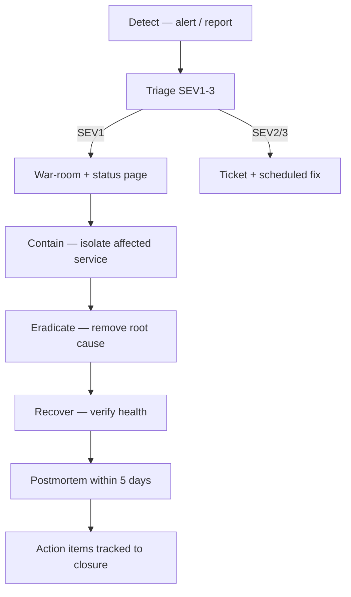
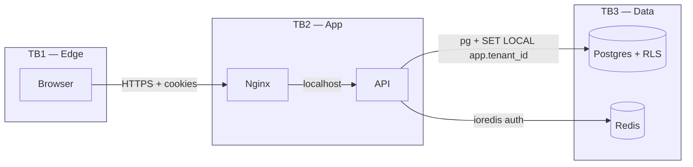

# 6. Security & Compliance — ProcureDesk Platform

> Audience: Security Lead, CISO office, Audit, DevOps.
> Scope: end-to-end security architecture, threat model, AuthN/Z, data protection, IAM, audit, incident response, vulnerability & supply-chain, tenant isolation, compliance mapping.

---

## 6.1 Security Architecture Overview

```mermaid
flowchart TB
    subgraph Untrusted[Untrusted Zone]
        UA[Browsers / Users]
    end
    subgraph Edge[Edge — Trust Boundary 1]
        NGX[Nginx + TLS<br/>WAF (recommended upstream)]
    end
    subgraph App[Application — Trust Boundary 2]
        API[NestJS API<br/>Helmet · CSRF · Rate-limit · Argon2 · Zod]
        WORK[Worker<br/>BullMQ · Outbox · Graph]
    end
    subgraph Data[Data — Trust Boundary 3]
        PG[(Postgres<br/>RLS per tenant)]
        RD[(Redis)]
        BLOB[(Azure Blob)]
    end
    subgraph Ext[External Trusted Services]
        GRAPH[Microsoft Graph]
    end

    UA -->|HTTPS 443| NGX
    NGX -->|HTTP localhost| API
    API --> PG
    API --> RD
    API --> BLOB
    WORK --> PG
    WORK --> RD
    WORK --> BLOB
    WORK -->|HTTPS + OAuth2| GRAPH
```

---

## 6.2 Threat Model (STRIDE-aligned, abridged)

| # | Asset | Threat | Vector | Mitigation |
|---|-------|--------|--------|-----------|
| T1 | Session cookie | Spoofing — token theft | XSS, network sniff | HttpOnly + SameSite + Secure cookies; CSP blocks inline scripts; TLS only |
| T2 | User password | Tampering / brute force | Credential stuffing | Argon2id; DB-backed login throttle; lockout |
| T3 | Cross-tenant data | Information disclosure | App-layer bug | Postgres RLS as enforcement floor; service-layer tenant filters |
| T4 | Mutating endpoints | Tampering — CSRF | Cross-site form post | Double-submit token + SameSite cookie |
| T5 | Imports endpoint | DoS — large upload | Big files / form bombs | Size cap, file count cap, field cap, header-pair cap |
| T6 | Login endpoint | DoS / brute force | Credential spray | Per-account DB throttle + global Redis 120/min/IP |
| T7 | Audit log | Repudiation | Mutated audit | Append-only `ops.audit_events`; write inside business txn |
| T8 | Secrets in env | Information disclosure | Repo leak | Gitleaks in CI; placeholder rejection at boot |
| T9 | Build supply chain | Tampering — malicious dep | Compromised package | `pnpm audit`; Trivy CVE scan; pinned lockfile |
| T10 | Worker → Graph | Token theft | Misconfigured app reg | Application-only token; no user delegation; mailbox restriction |
| T11 | DB direct access | Privilege escalation | Stolen DB creds | Network isolation; managed secrets; RLS still applies |
| T12 | Stored files | Information disclosure | Direct blob access | Private container; access via app-issued URLs only |

---

## 6.3 Authentication

- **Primary**: email + password.
- **Hash**: Argon2id (`argon2` package, default profile reviewed for memory/time cost).
- **Password policy**: per-tenant rules in `iam.password_policies` (length, history, expiry).
- **Password history**: reuse prevented via `iam.password_history`.
- **Session creation**: row in `iam.sessions`; cookie holds opaque signed ID, never the user data.
- **Idle timeout**: `SESSION_IDLE_TIMEOUT_MINUTES`.
- **Absolute timeout**: `SESSION_TTL_HOURS`.
- **Server revocation**: deleting `iam.sessions` row terminates the session immediately.
- **Login throttling**: `ops.login_rate_limits` per email + IP; lockout window configurable.
- **Future**: SSO / OIDC integration is a clean extension via a new `auth/oidc` strategy.

---

## 6.4 Authorization

- **Model**: RBAC with entity-level scoping.
- **Tables**: `iam.roles` × `iam.permissions` × `iam.role_permissions` × `iam.user_roles` × `iam.user_entity_scopes`.
- **Resolution**: at session creation, the user's roles, permissions, and entity scopes are resolved and cached on the request context.
- **Enforcement**: service-layer guards (`@RequiresPermission('case.update')`-style checks) plus tenant + entity scope filters in every query.
- **Floor**: Postgres RLS — even a missed app check cannot disclose another tenant's row.
- **Access levels** (`000008_user_access_level.sql`): `admin / standard / read-only` augment fine-grained permissions.

---

## 6.5 Data Protection

| Data | Classification | At rest | In transit | Retention |
|------|----------------|---------|-----------|-----------|
| User passwords | Highly sensitive | Argon2id hash | n/a | Indefinite (history table) |
| Session IDs | Sensitive | Postgres column | TLS | TTL 2 h |
| PII (email, name) | Sensitive | Postgres + Azure Blob (if uploaded) | TLS | Aligned to tenant retention policy |
| Procurement records | Confidential business | Postgres | TLS | Tenant-defined |
| Audit events | Confidential | Postgres append-only | TLS | ≥ 7 years (recommended) |
| Uploaded files | Mixed | Azure Blob (encrypted at rest) | TLS | Tenant-defined |
| Secrets | Highly sensitive | Env file 0600 / orchestrator secret | TLS to backing store | Rotated per §6.8 |

---

## 6.6 Encryption

- **In transit**: TLS 1.2+ at Nginx (HSTS recommended). Inter-container traffic on the docker bridge — same host, not routed externally.
- **At rest**: Postgres on host-encrypted disk; Azure Blob with provider-managed encryption (server-side, AES-256). Recommended: enable Postgres-level TDE / pgcrypto column encryption for highly sensitive future fields.
- **Cookies**: HMAC-signed (not encrypted) — they carry only opaque session IDs.
- **Keys**: `SESSION_SECRET`, `CSRF_SECRET` — minimum 32 chars, generated as 48-byte hex, rejected if placeholder.

---

## 6.7 Secret Management

| Secret | Local | Staging | Production |
|--------|-------|---------|-----------|
| DB DSN | `.env` | GH Actions secret | `/etc/procuredesk/.env.production` (root 0600) |
| Redis URL | `.env` | GH Actions | env file |
| `SESSION_SECRET` / `CSRF_SECRET` | `.env` | GH Actions | env file (rotated quarterly) |
| Microsoft Graph creds | optional `.env` | GH Actions | env file (rotated annually) |
| Azure Blob conn string | n/a (local FS) | GH Actions | env file (rotated annually) |

- Boot-time validation rejects placeholder substrings (`change-me`, `replace-with`, `local-`, `example`, `placeholder`, `your-`) outside dev/test (see `apps/api/src/config/env.schema.ts`).
- Pre-merge: Gitleaks scans the full git history.

---

## 6.8 IAM Strategy

- **Application IAM** — modelled in `iam.*` schema (see §6.4).
- **Infrastructure IAM**:
  - SSH to host — bastion + key-only.
  - Production env file — root-owned 0600.
  - GHCR push — workflow `GITHUB_TOKEN`.
  - Microsoft Graph — application registration with `Mail.Send` scoped to `MS_GRAPH_SENDER_MAILBOX`.
  - Azure Blob — connection string (recommended migration to managed identity).
- **Rotation cadence**:
  - Cryptographic secrets (`SESSION_SECRET`, `CSRF_SECRET`): quarterly.
  - Cloud client secrets (Graph, Blob): annually or on suspected exposure.
  - DB passwords: annually.
  - Personnel-tied access: removed within 24 h of off-boarding.

---

## 6.9 Audit Logging

- Append-only `ops.audit_events`.
- Written **in the same transaction** as the business change — guarantees no event is logged for a rolled-back operation, and no operation succeeds without a log.
- Captured fields: `tenant_id`, `actor_user_id`, `action`, `target_type`, `target_id`, `payload jsonb`, `ip_address`, `user_agent`, `request_id`, `at`.
- Retention: ≥ 7 years recommended for procurement / SOX-aligned posture.
- Export: quarterly batch to long-term cold storage (recommended).

---

## 6.10 Incident Response



**Severity definitions**

| SEV | Definition | Examples |
|-----|-----------|----------|
| SEV1 | User-facing outage or data breach | DB down; cross-tenant data leak suspected |
| SEV2 | Significant degradation | One queue stalled; one tenant impacted |
| SEV3 | Minor / cosmetic | Single endpoint slow; non-critical alert flap |

**Comms cadence**: SEV1 — every 30 min; SEV2 — at start, on resolution; SEV3 — ticket only.

---

## 6.11 Vulnerability Management

- **CI gates**: Gitleaks (every PR), `pnpm audit --prod --audit-level=high` (every PR), Trivy CVE scan on every Docker image (CRITICAL/HIGH fail the build).
- **Cadence**: weekly host patching; monthly base image rebuilds; quarterly dependency upgrade sweeps.
- **Disclosure handling**: triage within 1 business day; SEV1 vulnerabilities patched within 48 h.

---

## 6.12 Dependency & Supply Chain Security

- Lockfile `pnpm-lock.yaml` committed; CI installs `--frozen-lockfile`.
- `pnpm audit` enforced in CI (production deps, high+).
- Trivy scans built images for OS-level CVEs.
- Recommended additions:
  - SBOM generation (Syft) per release.
  - Image signing (Cosign) and verification at deploy time.
  - Renovate / Dependabot for automated upgrade PRs.

---

## 6.13 Tenant Isolation

- **Service layer**: every query filters by `tenant_id` resolved from session.
- **Database layer**: Row-Level Security policies (`db/migrations/committed/000002_rls.sql`) enforce `tenant_id = current_setting('app.tenant_id')::uuid` on every tenant-scoped table.
- **Connection initialisation**: `apps/api/src/database` sets `app.tenant_id` and `app.user_id` per request, scoped to the transaction (`SET LOCAL`).
- **Storage**: Azure Blob keys prefixed by tenant ID; access mediated by the API.
- **Recommended test**: integration tests that attempt cross-tenant access and assert 404 / RLS denial.

---

## 6.14 AI Security

Not applicable today (no LLM features). When introduced:

- All prompts/outputs logged via the audit pattern.
- PII redaction applied before model calls.
- Outputs treated as untrusted: never executed; sanitised before render.
- Cost & rate limits enforced per tenant.

---

## 6.15 Compliance Mapping

> The platform is **architected to support** these frameworks; certification is an organisational program, not a code change.

### 6.15.1 GDPR

| Requirement | Coverage |
|-------------|----------|
| Lawful basis & consent | Captured at tenant onboarding (out of scope for app) |
| Right to access / portability | Per-user data export via admin tooling (extend `imports/exports` module) |
| Right to erasure | Hard-delete user with audit retention exception; soft-delete pattern available |
| Breach notification (72 h) | Incident response §6.10 |
| Data minimisation | Schema captures only operational fields |
| Encryption | §6.6 |

### 6.15.2 SOC 2 (Type II readiness)

| Trust Service Criterion | Evidence |
|------------------------|----------|
| Security | RBAC, RLS, CSRF, hardened headers, secret hygiene, CI security gates |
| Availability | Health probes, restart policies, planned HA roadmap |
| Processing integrity | Idempotency keys, transactional outbox, append-only audit |
| Confidentiality | TLS, encryption at rest, tenant isolation |
| Privacy | Audit trail, secret management, scoped access |

### 6.15.3 ISO 27001

- A.5 Information security policies — documented in this set.
- A.8 Asset management — repository + infra inventory in this doc set.
- A.9 Access control — §6.3, §6.4, §6.8.
- A.12 Operations security — §6.10, §6.11, runbooks (doc 04).
- A.14 System acquisition, development & maintenance — CI gates, code review, runbooks.
- A.16 Information security incident management — §6.10.
- A.18 Compliance — this section.

---

## 6.16 Attack Surface Analysis

| Surface | Exposure | Controls | Residual Risk |
|---------|----------|---------|---------------|
| Public HTTPS endpoints | Internet | TLS, Helmet, CSRF, rate limit, body limits | Low — recommend upstream WAF |
| Login endpoint | Internet | Argon2, throttle, lockout | Low |
| Multipart upload | Authenticated | size cap, file/field caps, virus scan TBD | Med — add AV scanning before storage |
| Admin endpoints | Authenticated + RBAC | RBAC + audit | Low |
| Worker → Graph | Outbound | App-only token, mailbox restriction | Low |
| DB/Redis ports | Host-internal only | Network isolation | Low |
| Build pipeline | GitHub | Gitleaks, audit, Trivy | Low — add SBOM/signing |

---

## 6.17 Security Risk Matrix

| Risk | Likelihood | Impact | Score | Mitigation |
|------|-----------|--------|-------|-----------|
| Credential stuffing | High | Medium | High | Throttle + MFA roadmap |
| Supply chain compromise | Medium | High | High | Audit + Trivy; add SBOM/signing |
| RLS misconfiguration | Low | Critical | High | Integration tests + reviews |
| DDoS | Medium | Medium | Med | Edge WAF + Redis limit |
| Secret leakage | Low | Critical | Med | Gitleaks + boot rejection + 0600 |
| Insider abuse | Low | High | Med | Audit log + RBAC scope |
| Backup theft | Low | Critical | Med | Encrypt backups; off-host store |

---

## 6.18 Auth Flow & Trust Boundary Diagram



---

*End of Security & Compliance.*
