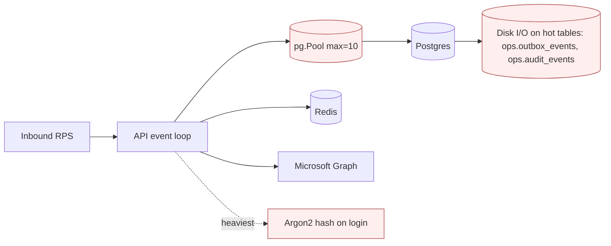
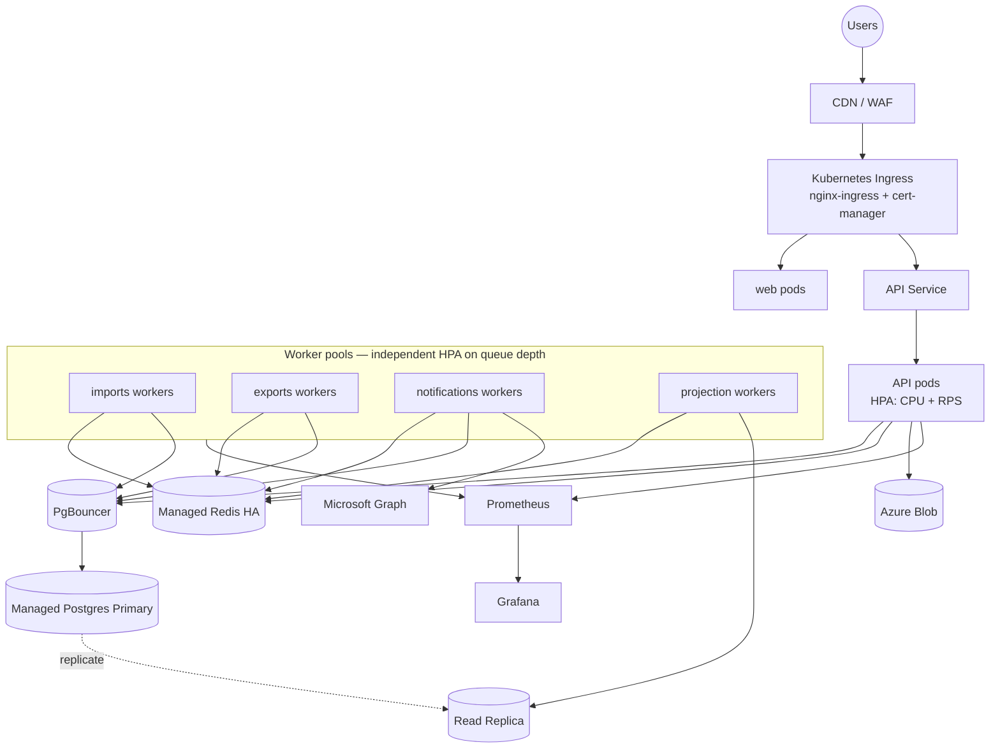
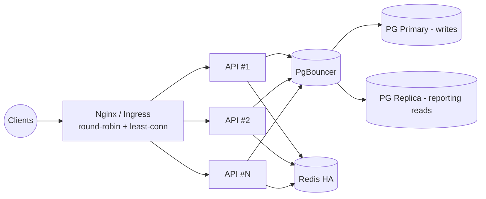
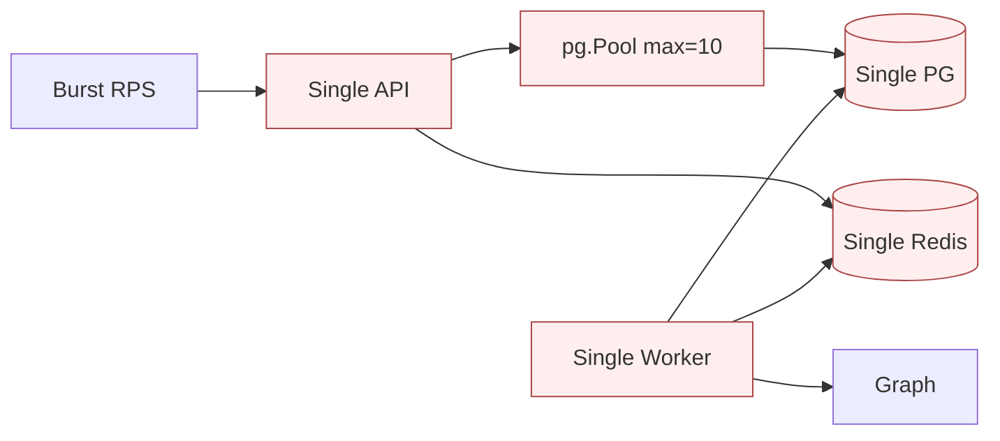

# 7. Performance & Scalability Assessment — ProcureDesk Platform

> Audience: Architects, SRE, Capacity Planning, Engineering Leadership.
> Scope: capacity model, bottleneck analysis, layer-by-layer performance posture, load/stress testing strategy, scaling roadmap, cost vs. scale.

---

## 7.1 Current Capacity (single-host baseline)

The production stack today runs on a single CLM host with the resource envelope from `infra/deploy/production-compose.yml`:

| Service | CPU (informal) | Memory reserved → limit | Replicas |
|---------|---------------|-----------------------|----------|
| API | 1 vCPU effective | 256 Mi → 512 Mi | 1 |
| Worker | 1 vCPU effective | 256 Mi → 512 Mi | 1 |
| Web (Nginx-served static) | minimal | unlimited | 1 |
| Reverse proxy (Nginx) | minimal | unlimited | 1 |
| Postgres 16 | host-managed | host-managed | 1 |
| Redis 7 | host-managed | host-managed | 1 |

**Indicative baseline throughput (engineering estimate, to be confirmed by load test)**

| Workload | Sustained | Peak (short burst) |
|----------|-----------|-------------------|
| Read-heavy GETs (cases list, dashboards) | ~150–250 RPS | ~500 RPS (Redis rate-limit hits at 120/min/IP per-client) |
| Mutating POST/PATCH | ~50–80 RPS | ~150 RPS |
| Login | ~10 RPS (DB-bound by Argon2id) | ~25 RPS |
| Excel imports | 1–2 concurrent jobs | 4 concurrent (bound by worker memory) |
| Excel exports | 1–2 concurrent jobs | 4 concurrent |
| Notifications dispatched | ~100/min | ~500/min (bound by Graph throttling) |

> These figures are estimates derived from the architecture; load tests (§7.11) must validate them.

---

## 7.2 Expected Traffic

| Profile | Daily Active Users | Concurrent peak | Mutations / day | Imports / day | Notifications / day |
|---------|-------------------|-----------------|----------------|---------------|--------------------|
| Year-1 (single tenant) | 50–200 | ~50 | ~5 000 | 5–20 | 500–2 000 |
| Year-2 (multi-tenant rollout) | 500–2 000 | ~250 | ~30 000 | 50–200 | 5 000–20 000 |
| Year-3 (group-wide) | 2 000–10 000 | ~1 000 | ~150 000 | 200–500 | 30 000–80 000 |

The single-host topology is comfortable through Year-1 and the early Year-2 envelope. Year-2 inflection point recommends moving to managed Postgres + multi-replica API + per-queue worker pods (§7.11).

---

## 7.3 Scaling Limits (current architecture)

| Component | Hard Limit | Soft Limit |
|-----------|-----------|-----------|
| API container | Single Node.js event loop | CPU saturation at sustained ~250 RPS heavy endpoints |
| Worker container | Single process for all queues | Memory pressure during large imports (>10 MiB workbook) |
| Postgres | `max_connections` (default 100) — pg.Pool max 10 per process | Hot-row contention on `ops.outbox_events` polling at very high enqueue rates |
| Redis | Single instance memory + AOF write pressure | Queue depth and rate-limit key churn |
| Nginx | Connection ceiling per worker process | TLS handshake CPU |
| Microsoft Graph | Tenant-level mail throttling | App-level concurrency limits |
| Azure Blob | Effectively unbounded | Per-account egress at multi-GB exports |

---

## 7.4 Bottleneck Analysis

**Top bottlenecks observed in design review**

1. **`pg.Pool` cap (10)** — under burst load, request queue inside the pool grows; `pg_stat_activity` shows waiters. Mitigation: PgBouncer in transaction mode + raised pool ceiling per replica.
2. **Outbox dispatcher polling cadence** — 10 s upper bound on async latency. Acceptable today; reduce to 2 s or move to LISTEN/NOTIFY for event-driven dispatch when throughput grows.
3. **Argon2id cost on login** — intentional CPU spend; protects against brute force. Acceptable; horizontal API scaling is the answer for higher login throughput.
4. **Excel import memory** — `exceljs` reads workbook into memory. Mitigation: streaming row reader; per-file size cap (`IMPORT_MAX_FILE_BYTES`).
5. **Single Redis** — queue + rate-limit colocated. Mitigation: HA Redis (Sentinel) before scale-out.

---

## 7.5 Database Performance

- **Indexes**: defined in `db/migrations/committed/000004_indexes.sql`; covers FKs and common filters (`tenant_id`, status enums, expiry windows).
- **Hot tables**: `procurement.cases`, `procurement.case_milestones`, `reporting.case_facts`, `ops.audit_events`, `ops.outbox_events`.
- **Query patterns**:
  - List-cases queries are tenant-scoped + status-filtered + paginated — well-served by composite indexes.
  - Reporting queries hit `reporting.*` projections rather than OLTP — keeps OLTP latency stable.
- **Recommendations**:
  - Enable `pg_stat_statements` and review top-20 monthly.
  - Partition `ops.audit_events` and `ops.outbox_events` once monthly volume exceeds ~50 M rows.
  - Add a read replica and route reporting endpoints to it.
  - Move to managed Postgres with PITR for both DR and performance (faster disks, autoscaling storage).

---

## 7.6 API Performance

- **Framework**: Fastify under NestJS — top-tier Node.js HTTP throughput.
- **Hot paths**:
  - JSON parse (1 MB cap).
  - CSRF verify — constant-time HMAC compare (cheap).
  - Zod validate — O(payload size); negligible at typical sizes.
  - DB roundtrip — dominant cost.
- **SLO targets** (recommended):
  - p50 ≤ 100 ms, p95 ≤ 400 ms, p99 ≤ 800 ms for read endpoints.
  - p95 ≤ 600 ms, p99 ≤ 1 200 ms for write endpoints.
- **Tactics to hold SLOs**:
  - Index review per new endpoint.
  - Cache idempotent reference data (catalog).
  - Avoid N+1 by batching reads in services.

---

## 7.7 Frontend Performance

- React 19 + Vite 6 — ESM-first builds, code-splitting per route.
- TanStack Query reduces redundant fetches.
- Tailwind JIT keeps CSS small.
- **Targets**:
  - First Contentful Paint < 1.5 s on 4G.
  - Largest Contentful Paint < 2.5 s.
  - Time to Interactive < 3.0 s.
- **Tactics**:
  - Long-cache static chunks (`Cache-Control: immutable`).
  - HTTP/2 (already implicit in TLS at Nginx).
  - Future: HTTP/3 + Brotli compression at Nginx; CDN in front.

---

## 7.8 Cache Strategy

| Layer | Today | Recommended |
|-------|-------|-------------|
| Browser HTTP cache | default | Long-cache hashed assets; short-cache index.html |
| TanStack Query | per-query staleness | Tune per resource; aggressive for catalog (15 min) |
| API in-memory | none | Process-local LRU for tenant-scoped catalog (1–5 min TTL) |
| Redis cache | rate-limit only | Add key namespace for shared catalog cache; invalidate via outbox event |

---

## 7.9 Queue Throughput

- BullMQ on Redis — well above current scale; published benchmarks routinely > 10k jobs/s.
- Bottleneck before Redis is **worker concurrency** — bounded by per-job CPU/IO and Postgres pool.
- **Tactics**:
  - Per-queue concurrency tuned independently (imports lower, notifications higher).
  - Split worker into per-queue deployments at scale.
  - Promote `bullmq_queue_*` Prometheus metrics for HPA in Kubernetes.

---

## 7.10 CDN Strategy

- Today: none — Nginx serves SPA assets directly.
- Recommended at multi-tenant scale: front Nginx with Cloudflare / Azure Front Door for:
  - Static asset caching globally.
  - WAF + DDoS absorption.
  - TLS termination relief.

---

## 7.11 Autoscaling Strategy

| Tier | Today | Future |
|------|-------|--------|
| API | manual `docker compose up -d --scale api=N` (requires nginx upstream config) | Kubernetes HPA on CPU + RPS |
| Worker | manual scale | Kubernetes HPA on **BullMQ queue depth** (custom metric) |
| Postgres | vertical only | Managed DB with read replicas |
| Redis | vertical only | Sentinel/Cluster with managed offering |
| Storage | Azure Blob | already elastic |

---

## 7.12 Load Testing Strategy

| Scenario | Tool | Target |
|----------|------|--------|
| Steady-state read mix | k6 / Gatling | 200 RPS, p95 ≤ 400 ms |
| Steady-state write mix | k6 | 80 RPS, p95 ≤ 600 ms |
| Login surge | k6 | 25 RPS without lockouts to legitimate users |
| Import burst | custom script enqueueing | 4 concurrent imports without queue starvation |
| Notification fan-out | enqueue 5 000 jobs | drained < 10 min without DLQ growth |

Run cadence: pre-major-release, after schema changes touching hot tables, after pool/worker concurrency tuning.

---

## 7.13 Stress Testing

- **Goal**: identify breakpoints, not pass/fail.
- **Method**: ramp RPS until first SLO breach; record CPU, memory, pool waiters, queue depth at each step.
- **Output**: a documented saturation point per release; capacity plan derived from headroom.

---

## 7.14 Cost vs. Scale Analysis

| Stage | Topology | Indicative monthly cost driver |
|-------|----------|-------------------------------|
| Year-1 | Single VM (CLM) | VM + Azure Blob + Graph quota — single-digit cost band |
| Year-2 | Managed Postgres (small) + 2× API + 2× worker + managed Redis | Mid cost band; DB dominates |
| Year-3 | Managed Postgres (medium + replica) + 4–8× API + 4× worker + managed Redis HA + CDN | High cost band; DB + CDN dominate |

**Cost levers**:
- Right-size worker memory (imports drive peaks).
- Aggressive caching of catalog data shrinks DB load.
- Move reporting reads off primary to slash primary CPU.
- Image base layers shared across api/worker reduce GHCR egress.

---

## 7.15 Future Scaling Roadmap

1. Move Postgres to a managed service with PITR and a read replica.
2. Introduce PgBouncer (transaction mode) in front of Postgres.
3. Split worker into per-queue Kubernetes deployments with HPA on queue depth.
4. Replace outbox polling with `LISTEN/NOTIFY` to cut async latency.
5. Add edge WAF + CDN.
6. Partition `ops.audit_events` and `ops.outbox_events` by month.
7. Promote process-local catalog cache to Redis-backed cluster cache.
8. Add OpenTelemetry tracing to expose end-to-end latency budgets.

---

## 7.16 Scaling Architecture Diagram (target state)

## 7.17 Load Distribution Diagram

## 7.18 Bottleneck Diagram (current)

---

*End of Performance & Scalability Assessment.*
