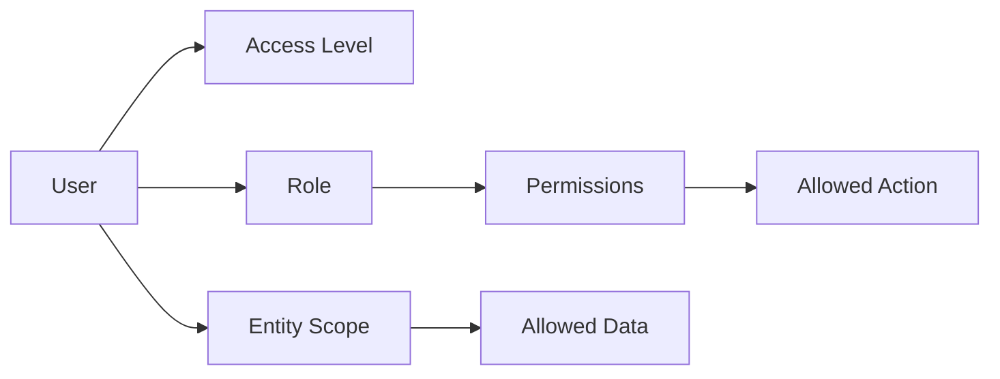

# Role & Permission Management Framework

> Audience: Senior Management, Business Stakeholders, Leadership Team  
> Basis: Current ProcureDesk implementation in database migrations, seed data, API guards, services, and role-aware UI.

---

## 1. Overview

ProcureDesk uses a Role-Based Access Control (RBAC) model to ensure that each user receives access aligned to their business responsibility. The platform controls access through four connected layers:

This model improves security, accountability, and operational control by limiting sensitive actions to authorized users and restricting procurement data by ownership, entity, or group-level visibility. It also supports audit readiness by tracking key administrative and business actions.

---

## 2. Objective

The current RBAC framework is designed to support:

- **Controlled access management** for users, roles, entities, procurement cases, reports, imports, notifications, and audit logs.
- **Segregation of duties** between administration, group-level operations, entity-level operations, tender ownership, and read-only review.
- **Data security** through tenant isolation, entity scope, assigned-case visibility, and permission checks.
- **Governance of critical actions** such as user management, role assignment, case updates, imports, exports, and audit access.
- **Audit readiness** through recorded changes for user access, roles, cases, awards, imports, notifications, and security settings.
- **Reduced operational risk** by protecting system roles, enforcing valid role/access-level combinations, and preserving at least one active tenant administrator.

---

## 3. Role Hierarchy / User Types

The system ships with protected system roles and also supports tenant-specific custom roles. System roles are centrally defined and cannot be edited or deleted through the tenant role management flow.

| Role | Responsibilities | Access Level |
|---|---|---|
| **Super Admin** | Full platform-level authority across modules and tenants. Bypasses standard permission checks and should be restricted to exceptional support or platform administration use. | Group / platform-wide |
| **Administration Manager** | Manages the admin console, users, roles, entities, catalog/master data, security configuration, notifications, and audit visibility. | Group-level administration |
| **Group Manager** | Manages procurement operations across the tenant, including all cases, planning, awards, imports, reports, exports, and delay visibility/management. | Group-level operations |
| **Entity Manager** | Manages procurement activity for assigned entities, including entity cases, planning, awards, imports, reports, and exports. | Entity-scoped operations |
| **Tender Owner** | Creates and manages assigned procurement cases and awards, with reporting/export access for assigned work. | Assigned-user access |
| **Entity Viewer** | Read-only access to procurement cases and reports for assigned entities. | Entity-scoped view |
| **Group Viewer** | Read-only group-level procurement and reporting access, including report export. | Group-level view |
| **Custom Tenant Role** | Tenant-defined role created from approved permission combinations. Used where business teams need a tailored access bundle. | Based on assigned permissions |

Access levels enforced by the system:

| Access Level | Meaning |
|---|---|
| **GROUP** | Can operate across the tenant where permissions allow. |
| **ENTITY** | Can operate only for mapped entities where permissions allow. |
| **USER** | Can operate primarily on assigned or owned records where permissions allow. |

---

## 4. Permission Model

Permissions define what a role can do. The API enforces permissions on protected routes and services; the web application also hides unavailable workspaces and actions based on the same permission model.

Current permission categories include:

- **Administration:** admin console access, user management, role management, permission catalog visibility, tenant/system configuration.
- **Organization & Catalog:** entity/department read and management, tender type and reference data management.
- **Procurement Cases:** create, read assigned/entity/all, update assigned/entity/all, delete, restore, delay read/manage.
- **Awards & Planning:** award management and tender planning management.
- **Reporting & Data Movement:** report read, report export, import management.
- **Controls:** audit log read and notification rule management.

Important implementation note: the current codebase does **not** define a separate `Approver` role or standalone `approve` / `reject` permissions. Approval-style business authority is currently represented through procurement update, planning, and award-management permissions.

### Indicative Permission Matrix

| Module / Capability | Super Admin | Admin Mgr | Group Mgr | Entity Mgr | Tender Owner | Entity Viewer | Group Viewer |
|---|:---:|:---:|:---:|:---:|:---:|:---:|:---:|
| Admin Console | ✓ | ✓ |  |  |  |  |  |
| User & Role Management | ✓ | ✓ | View all users | View entity users |  |  |  |
| Entity & Department Setup | ✓ | ✓ | View | View | View | View | View |
| Catalog / Master Data | ✓ | Manage | View | View | View | View | View |
| Case Creation | ✓ |  | ✓ | ✓ | ✓ |  |  |
| Case Visibility | ✓ |  | All tenant cases | Assigned entities | Assigned cases | Assigned entities | All tenant cases |
| Case Updates | ✓ |  | All tenant cases | Assigned entities | Assigned cases |  |  |
| Case Delete / Restore | ✓ |  |  |  |  |  |  |
| Delay Management | ✓ |  | All tenant delays |  |  |  |  |
| Awards | ✓ |  | Manage | Manage | Manage |  |  |
| Planning | ✓ |  | Manage | Manage |  |  |  |
| Imports | ✓ |  | Manage | Manage |  |  |  |
| Reports | ✓ |  | View / Export | View / Export | View / Export | View | View / Export |
| Audit Logs | ✓ | ✓ |  |  |  |  |  |
| Notifications | ✓ | ✓ |  |  |  |  |  |

---

## 5. Key Business Benefits

- **Improved security** by combining role, permission, tenant, entity, and ownership controls.
- **Better compliance** through clear access rules and auditable user administration.
- **Reduced unauthorized access** to procurement, vendor, operational, and financial records.
- **Clear accountability** for administrative changes, case changes, award changes, imports, exports, and notification changes.
- **Easier audit tracking** through centralized audit events with actor, action, target, timestamp, and request metadata.
- **Better operational governance** by separating platform administration, tenant administration, group operations, entity operations, ownership, and viewing.
- **Scalable user management** through reusable system roles and custom tenant roles.

---

## 6. Governance & Control

| Control Area | Current Implementation |
|---|---|
| **Access Approval** | Access is assigned by authorized administrators through roles, access level, and entity scope. |
| **Role Assignment** | Users must have at least one valid assignable role. Role/access-level combinations are validated before assignment. |
| **Entity Scope** | Entity-scoped users must be mapped to at least one entity. Group-level users do not require entity mappings. |
| **System Role Protection** | System roles cannot be edited or deleted through tenant role management. They can be cloned conceptually via custom roles if different access is required. |
| **Tenant Admin Continuity** | The system prevents removing or deactivating the last active tenant administrator. |
| **Audit Logs** | Key access and business changes are written to `ops.audit_events`, including user, role, access-level, entity-scope, case, award, import, notification, and security actions. |
| **Least Privilege** | Permission checks, permission inheritance, entity scopes, and assigned-case rules limit users to the minimum practical access. |

---

## 7. Suggested Best Practices

- Use the shipped system roles as the baseline for onboarding and create custom roles only when there is a clear business need.
- Restrict **Super Admin** access to a very small platform support group.
- Assign **GROUP** access only to users with cross-entity responsibility.
- Use **ENTITY** access for department or entity-level operational teams.
- Use **USER** access for tender owners and users responsible only for assigned work.
- Review role assignments, access levels, and entity scopes quarterly.
- Review custom tenant roles before production rollout and after major process changes.
- Keep audit history enabled for administrative and procurement-critical actions.

---

## 8. Conclusion

ProcureDesk's RBAC framework is implemented as a layered governance model: users receive roles, roles grant permissions, access levels define operational reach, and entity scopes restrict data visibility. This supports secure and scalable procurement operations while giving leadership clear control over who can administer, view, create, update, import, export, and audit business records.

The current model is management-ready for enterprise use because it protects system roles, supports custom tenant roles, enforces least privilege, tracks critical actions, and aligns user access with business responsibility.
